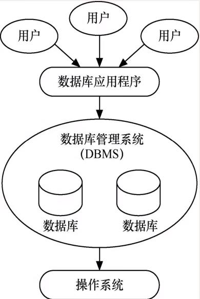
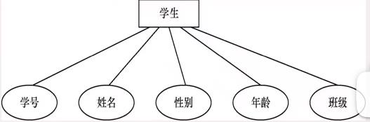
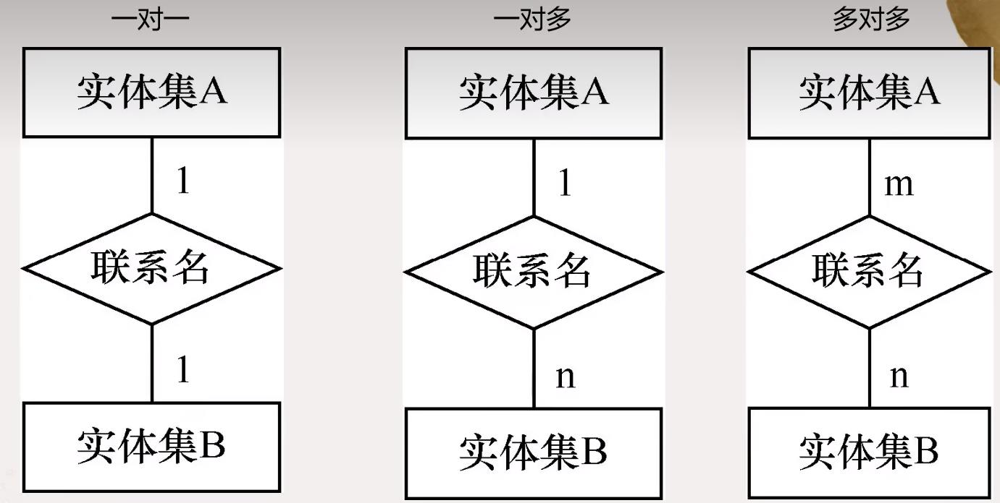
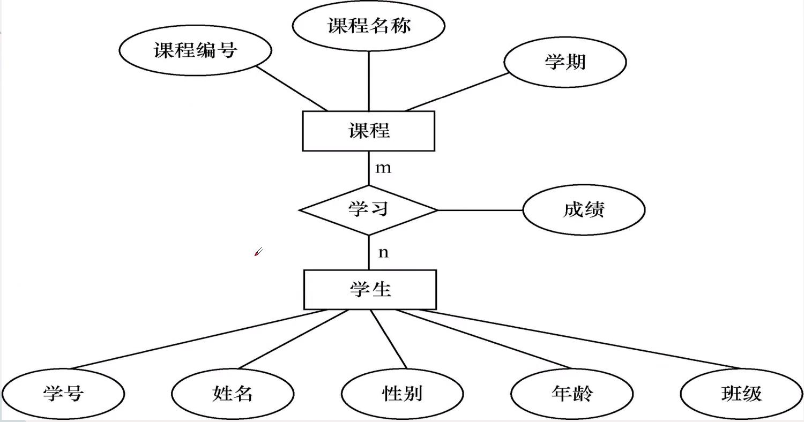
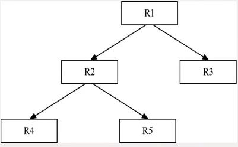
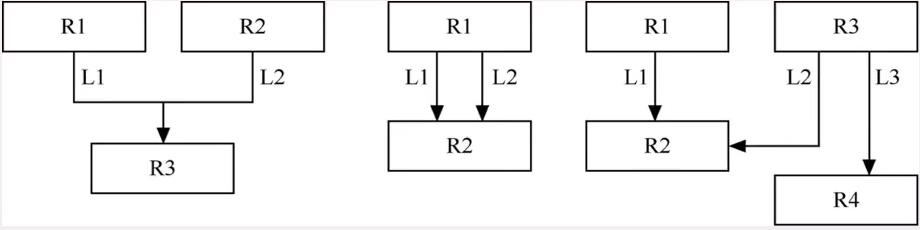
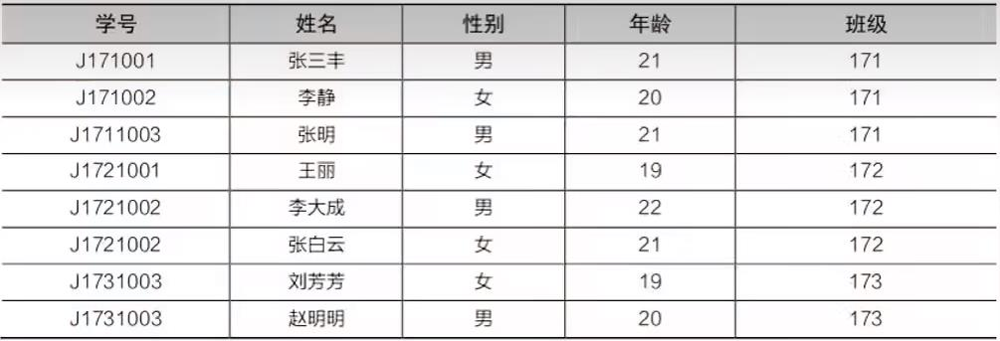
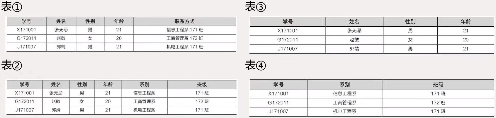

介绍数据库的一些基本概念，数据库技术的特点以及数据模型、数据库设计的步骤。
[TOC]
## 数据库基本概念
1. 信息
   信息是现实世界事物的存在方式或者运动状态的反映，它通过符号和信号等具体形式表现出来。信息具有可感知、可存储、可加工、可再生等自然属性，是各行业不可或缺的资源。
2. 数据
   数据是描述事物的符号记录，可以是数字，文字，图形和声音等。数据是数据库中存储的基本对象，是信息的载体。（灰灰，女，2000.8，武汉，计算机系，2018）
3. 数据库(DB)
   数据库就是存放数据的仓库。长期存储在计算机中的，是有组织的、可共享的相关数据集合。具有逻辑关系和确定意义；针对明确的应用目标而设计建立和加载的；
4. 数据库管理系统
   数据库管理系统是一种操纵和管理数据库的大型软件，用于建立、使用使用和维护数据库。
   可以对数据进行定义、操纵，运行管理，组织存储与保护维护功能。
5. 数据库系统
   数据库系统是计算机系统的重要组成部分，是指引入了数据库后的计算机系统。DBS通常由硬件、软件、数据库、人员组成。
   
## 常见的数据库
1. Oracle
2. SQL Server
3. MySQL
4. DB2
5. Access
6. SQLite
## 数据模型
   数据模型也是一种模型，它是数据特征的抽象，是数据库系统的核心和基础，它从抽象层次上描述了系统的静态特征、动态行为和约束条件，为数据库系统的信息表示与操作提供了一个抽象的框架。
   数据模型所描述内容的三部分：`数据结构、数据操作、数据的约束条件`；
### 数据模型的分类
   - 概念模型
    一种面向用户、面向客观世界的模型，主要用来描述世界的概念化结构。
   - 数据模型
    直接面向数据库的逻辑结构，是对现实世界的第二次抽象。
    > 常见的数据模型：层次模型， 网状模型， 关系模型
### 概念模型的表示方法
   最常用的方法：实体-联系方法（E-R）
   实体型用矩形表示；属性用椭圆表示；联系用菱形表示；联系主要有一对一、一对多、多对多；
   
   
   
### 常见的数据模型
   1. 层次模型
    用树形结构表示各类实体及实体间的联系。有且仅有一个结点无双亲结点；除根节点外其他结点仅有一个双亲结点；
    
   2. 网状模型
    用网洛结构表示各类实体及实体间联系。允许一个以上的结点无双亲结点；一个结点可以有多于一个双亲结点；
    
   3. 关系模型
    用二维表的形式表示各类实体及实体间的联系。关系模型是目前最重要的一种数据模型。关系模型的数据结构：是一种二维表结构，由行和列组成：
    
        > 表中设计一些常用术语
        > 关系：一个关系对应一张二维表，二维表名就是关系名；
        > 元组：表中一行就是一个元组，也称为记录；
        > 属性：表中一列成为一个属性，也称为字段。列值就是属性值，取值范围称为域；
        > 分量：每一行对应的列的属性值，即元组中的一个属性值；
        > 关系模式：对关系的描述称为关系模式，一般表示为关系名（属性1， 属性2，……， 属性n）；
        > 候选键或候选码：关系中存在多个属性或属性集都能唯一标识该关系的元组，这些属性或属性集便为此；
        > 主键或主码：在一个关系的若干候选键中指定一个用来唯一标识该关系的元组，这些属性或属性集便为此；
        > 主属性和非主属性：包含在任何一个候选键中的属性称为主属性，反之称为非主属性；
        - 关系模型的数据操作与完整性约束
        关系模型的数据操作主要有查询、插入、删除、修改，这些操作必须满足关系模型的完整约束条件
            - 实体完整性规则(值不能为空且唯一)
            - 参照完整性规则(约束一些相关联的数表间的数据保持一致)
            - 用户定义的完整性规则(针对具体数据库的约束条件并且由相关的应用环境确定)
        - 关系模型的优缺点
            优点：
                1. 数据结构单一
                2. 关系规范化
                3. 概念简单
            缺点：存储路径`透明`(看不见)，查询效率不如非关系数据模型；
    4. 面向对象模型
        常见概念： 类、对象、封装继承；
        优点：适合处理丰富的数据类型；开发效率高；提高了数据访问的性能；
        缺点：没有准确的定义；维护起来比较麻烦；不适合所有应用；
## 关系数据库及规范化
范式——某一种级别的关系模式的集合，是衡量关系模式规范化程序的标准，符合标准的关系才是规范化的。范式可以分为多个等级：第一范式（1NF）、第二范式（2NF）、第三范式（3NF）、第四范式（4NF）等。
### 第一范式（1NF）
关系模式设计中的最基本要求。
如果关系模式R中所有的属性都是不可分割的，则称该关系模式R满足第一范式。

> 表1不是第一范式，联系方式可以分解。
> 解决方法：
> 1. 将联系方式分解（如表2）
> 2. 将表1拆成2个表（如表3， 表4）
### 第二范式（2NF）
> 什么是函数依赖？
> A B 是关系模式R中的两个属性或属性组合，A的值确定，B的值就可以唯一确定，即A函数确定B函数，或者B函数依赖A函数，记作A->B;
> 如果A->B是R的一个函数依赖，且对于A的任何一个真子集A'，A'->B都不成立，则称A->B是完全函数依赖。反之，如果A'->B则称A->B是部分函数依赖。

如果一个关系模式属于第一范式，且R中每一个非主属性都完全函数依赖于主码，则称该关系模式R满足第二范式，简称2NF。
2NF是在1NF的基础上建立起来的，要求实体的非主属性必须完全依赖主码，不能存在仅依赖主码一部分的属性，如果存在则要把这个属性和主码的这一部分分离出来形成一个新的关系。
> 学生成绩表：
> 学号， 姓名， 课程号， 课程名， 成绩
> 不满足2NF的关系会出现诸如插入异常、删除异常和修改异常等问题。
### 第三范式（3NF）
如果一个关系模式属于2NF，且R中每个非主属性都不传递函数依赖于主码，则称该关系模式R满足第三范式，简称3NF。
> 所谓传递函数依赖是指假设A、B、C是关系模式中的3个属性或属性组合，如果A->B, B->c, 则称C对A传递函数依赖，传递函数依赖记作A->C。

例如，学生信息表（学号，姓名，年龄，班级号，班主任）中，"班主任"依赖于"学号"。"班主任"对"学号"的依赖是因为"班主任"依赖于"班级号"， "班级号依赖于"学号"而产生的。这样就构成了传递依赖，因此不符合3NF。
> - 要想让这个关系模式符合3NF，可以将其分解为两个关系模式：
>   1. 学生信息表（学号，姓名，年龄，班级号）
>   2. 班级信息表（班级号，班主任）
> - 可以将其分解为三个符合2NF的关系模式：
>   1. 学生信息表（学号，姓名）
>   2. 课程信息表（课程表，课程名）
>   3. 成绩表（学号，课程号，成绩）

## 本章小结
- 数据库基本信息：信息、数据、数据库、数据库管理系统、数据库系统。
- 常见的数据库：Oracle、SQL Server、MySQL、DB2、Access、SQLite。
- 数据库管理技术的发展：人工管理阶段、文件系统阶段和数据库系统阶段。
- 概念模型及E-R图表示法。
- 常见的数据模型：层次模型、网状模型、关系模型和面向对象模型。
- 关系数据库的规范化：1NF、2NF、3NF。