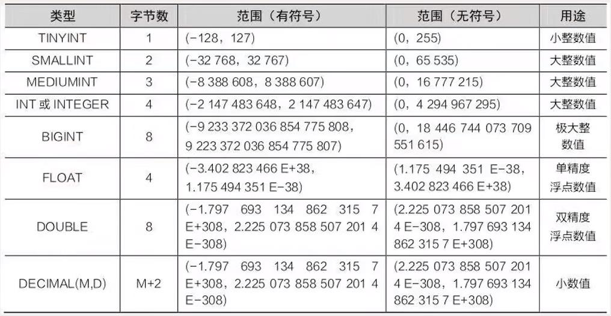
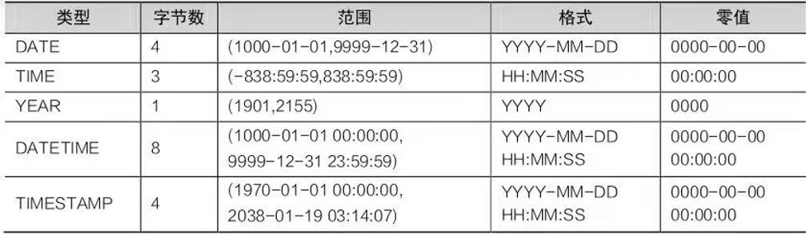
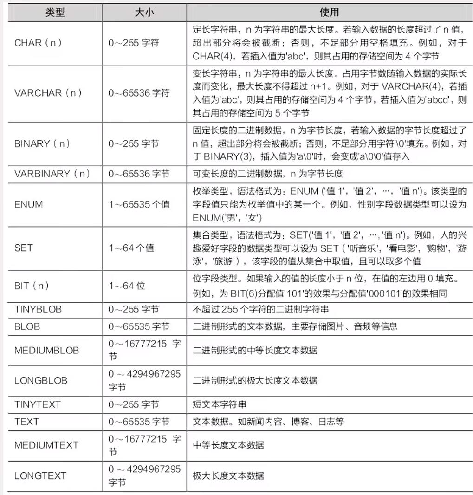
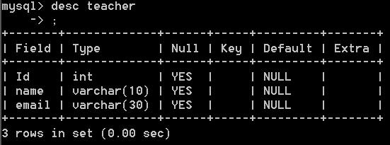
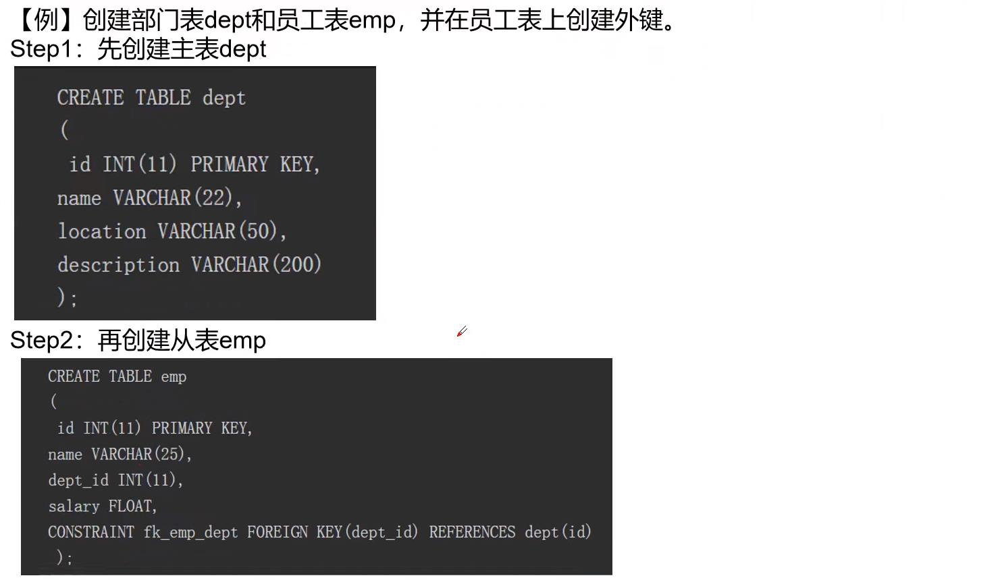
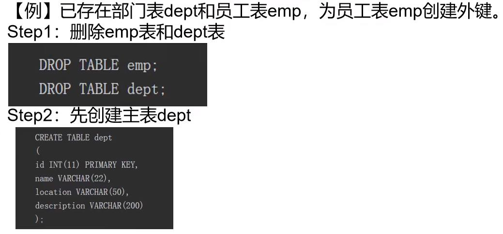

介绍简单的SQL语句。（增删改查）

[TOC]

# 数据库的基本操作
1. 创建数据库
   创建数据库就是在数据库系统中划分一块存储数据的空间，方便数据的分配、放置和管理。在`MySQL`中使用`CREATE DATABASE`命令创建数据库，语法格式如下：
    `CREATE DATABASE 数据库名称`
    > 注：“数据库名称”必须是唯一的！
2. 查看数据库
   在`MySQL`中，查看数据库的语法格式如下：
   `SHOW DATABASE`
   > 注：使用该命令可以查询在`MySQl`中已经存在的所有数据库！
3. 修改数据库
   数据库创建之后，数据库编码方式就确定了。修改数据库的编码方式，可以使用`DATABASR`语句，具体语法如下：
   > `ALTER DATABASE 数据库名称 DEFAULT CHARACTER SET 编码方式 COLLATE 编码方式_bin;`

   其中"数据库名称"是要修改的数据库的名字，"编码方式"是修改后的数据库编码方式。
   ***
   例 将数据库xxgc的编码方式修改为gbk.
   SQL语句如下：
   `ALTER DATABASE xxgc DEFAULT CHARACTER SET gbk COLLATE gbk_bin;`
4. 删除数据库
   删除数据库可以使用`DROP DATABASE`命令，具体语法格式如下：
   `DRAP DATABASE 数据库名称;`
   其中“数据库名称”是要删除的数据库的名字。需要注意的是，如果要删除的数据库不存在，则会出现错误。
   ***
   例：删除名为xxgc的数据库。
   SQL语句如下：
    `DROP DATABASE xxgc;`
# 数据类型
MySQL支持多种数据类型，大致分为四类：数值类型，日期和时间类型、字符串类型和二进制类型。
1. 数值类型
   MySQL支持所有标准SQL数值类型，包括精确数值类型和近似数值类型。
   
2. 日期和时间类型
   表示日期和时间值的日期和时间类型有`DATETIME`、`DATE`、`TIMESTAMP`、`TIME`和`YEAR`。
   每个时间类型有一个有效值范围和一个“零”值，当输入不合法的值时，MySQL使用“零”值插入。
   
3. 字符串和二进制类型
   为了存储字符串，图片和声音等数据，MySQL提供了字符串和二进制类型。
   
# 数据表的基本操作
1. 创建数据表
   数据库创建成功之后，接下来需要在数据库中创建数据表，因为数据表是数据库中存放数据的对象实体。没有数据表，数据库中其他的数据对象就没有意义。
   注：在创建数据表之前，一定要使用"`USE 数据库名`"明确是在哪个数据库中创建的，否则系统会抛出“`NO database selected`”错误。创建数据表的语法格式如下：
   ```
   CREATE TABLE 数据表名称
   （
   字段名1 数据类型 [完整约束条件],
   字段名2 数据类型 [完整约束条件],
   ...
   字段名3 数据类型 [完整约束条件]
   );
   ```
   在上述语法格式中，"数据表名称"是创建的数据表的名字，"字段名"是数据表的列名，"完整性约束条件"是字段的特殊约束条件。
2. 查看数据表
   - 使用`SHOW CREATE TABLE`语句查看数据表语法格式如下：`SHOW CREATE TABLE 数据表名称;`
        > 例： `SHOW CREATE TABLE teacher;`
    - 使用`DESCRIBE`语句查看数据表使用`DESCRIBE`语句查看数据表，可以查看到数据表的字段名、类型。是否为空，是否为主键等信息。语法格式如下：
    `DESCRIBE 表名；`  `DESC 表名`

      
        > `Field`表示该表的字段名；`Type`表示对应字段的数据类型；`Null`表示对应字段是否可以存储`NULL`值；`Key`表示对应字段是否编制索引和约束；`Default`表示对应字段是否有默认值；`Extra`表示获取到的与对应字段相关的附加信息。
3. 修改数据表
   数据表创建之后，用户还可以对表中的某些信息进行修改，包括修改数据表的结构以及表中字段的信息，如修改表名、修改字段名、修改字段的数据类型等。
   - 修改表名语法格式如下：
  `ALTER TABLE 旧表名 RENAME TO 新表名;`
    - 修改字段名和数据类型
  语法格式：`ALTER TABLE 表名 CHANGE 旧字段名 新字段名 新数据类型；`
        > 其中，“旧字段名”是修改之前的字段名称， “新字段名”是修改之后的字段名称，“新数据类型”是修改后的数据类型。注意，修改后的数据类型不能为空。如果只修改字段名，不修改数据类型，可以将新数据类型写为字段原来的数据类型。
     - 修改字段的数据类型
  语法格式如下：
  `ALTER TABLE 表名 MODIFY 字段名 新数据类型;`
     - 添加字段
    语法格式如下：
    `ALTER TABLE 表名 ADD 新字段名 数据类型[约束条件] [FIRST|AFTER已经存在的字段名]；`
        > 其中，“新字段名”是新添加的字段名称，“FIRST”是可选参数，用于将新添加的字段设置为表的第一个字段，“AFTER已经存在的字段名”也是可选参数，用于将新添加的字段添加到指定字段的后面。如不指定位置，则默认将新添加字段追加到表末尾。
     - 删除字段
    语法格式如下：
    `ALTER TABLE 表名 DROP 字段名;`
     - 修改字段的位置
    语法结构：`ALTER TABLE 表名 MODIFY 字段名1 新数据类型 FIRST|AFTER字段名2;`
        > 其中，“FIRST”是可选参数，用于将“字段名1”设置为表的第一个字段，“AFTER字段名2”也是可选参数，用于将“字段名1”移动到“字段名2”的后面。此命令可以同时修改字段的数据类型和位置。如果只修改位置，不修改数据类型，可以将新数据类型写为字段原来的数据类型。
     - 删除数据表
    语法格式：`DROP TABLE 表名;`
# 数据表的约束
约束的目的是保证数据库中数据的完整性和一致性。在MySQL中，常见的表约束有以下几种：`PRIMARY KEY CONSTRAINT（主键约束）、FOREIGN KEY CONSTRAINT（外键约束）、NOT NULL CONSTRAINT（非空约束）、UNIQUE CONSTRAINT（唯一约束）、DEFAULT CONSTRAINT（默认约束）`
## PRIMARY KEY CONSTRAINT（主键约束）
主键，又称主码，由表中一个字段或多个字段组成，能够唯一标识表中一条记录。主键约束要求主键字段中的数据唯一，并且不允许为空。主键分为两种类型：单字段主键和复合主键。注意，每个数据表中最多只能有一个主键。
- 单字段主键
   1. 创建表时指定主键，语法格式：`字段名 数据类型 PRIMARY KEY;`
   2. 为已存在的表添加主键约束，语法格式：`ALTER TABLE 表名 MODIFY 字段名 数据类型 PRIMARY KEY;`
   3. 删除主键约束，语法格式：`ALTER TABLE 表名 DROP PRIMARY KEY;`
- 复合主键
复合主键指主键由多个字段组成。
   1. 创建表时指定复合主键，语法格式：`PRIMARY KEY (字段名1， 字段名2， ...， 字段名3);`
   其中"字段名1， 字段名2， ...， 字段名3"指的是构成主键的多个字段名称。
   2. 为已存在的表添加复合主键，语法格式：`ALTER TABLES 表名 ADD PRIMARY KEY (字段名1， 字段名2， ...， 字段名3);`
   3. 删除复合主键约束，语法格式：`ALTER TABLE 表名 DROP PRIMARY KEY;`
## FOREIGN KEY CONSTRAINT（外键约束）
外键在两个表的数据之间建立关联，它可以是一个字段或者多个字段。一个表可以有一个或者多个外键。一个表的外键可以为空值，若不为空值，则每一个外键值必须等于另一个表中主键的某个值。注意，关联指的是在关系数据库中，相关表之间的联系。它是通过相同或者相容的字段或字段组来表示的。子表的外键必须关联父表的主键，且关联字段的数据类型必须匹配。定义外键后，不允许在主表中删除与子表具有关联关系的记录。主表（父表）：对于两个具有关联关系的表而言，相关联字段中主键所在的那个表即主表。从表（子表）：对于两个具有关联关系的表而言，相关联字段中外键所在的那个表即从表。
1. 创建表时条件外键约束语法格式：`CONSTRAINT 外键名 FOREIGN KEY （从表的外键字段名） REFERENCES 主表名（主表的关键字段名）`
   其中，“外键名”是指从表创建的外键约束的名字。
   
   > 注意：主表dept的主键字段id和从表emp的外键字段dept_id的数据类型必须兼容或者一致，且含义一样。在创建表时，先创建表的主外键关联，必须先创建主表，再创建从表。
2. 为已存在的表添加外键约束，语法格式：`ALTER TABLE 从表名 ADD CONSTRAINT 外键名 FOREIGN KEY （从表的外键字段名） REFERENCES 主表名（主表的主键字段名）;`
   其中，“外键名”是指从表创建的外键约束的名字。
   
3. 删除外键约束，语法格式：`ALTER TABLE 从表名 DROP FOREIGN KEY 外键名;`
## NOT NULL CONSTRAINT（非空约束）
非空约束指字段的值不能为空。在同一个数据表中可以定义多个非空字段。
1. 创建表时添加非空约束，语法格式：`字段名 数据类型 NOT NULL;`
2. 为已经存在的表添加非空约束，语法格式：`ALTER TABLE 表名 MODIFY 字段名 新数据类型 NOT NULL;`
此命令可以同时修改字段的数据类型和增加非空约束。如果不修改字段的数据类型，将“新数据类型”写为字段原来的数据类型即可。
3. 删除非空约束，语法格式：`ALTER TABLE 表名 MODIFY 字段名 数据类型;`
## UNIQUE CONSTRAINT（唯一约束）
唯一约束要求该列值唯一，不能重复。唯一约束可以确保一列或者几列不出现重复值。
1. 创建表时添加唯一约束，语法格式：`字段名 数据类型 UNIQUE;`
   > 注意：一个表中可以有多个字段声明为唯一约束，但是只能有一个主键；声明主键的字段不能不允许有空值，但是声明为唯一约束的字段允许存在空值。
2. 为已存在的表添加唯一约束，语法格式：`ALTER TABLE 表名 MODIFY 字段名 新数据类型 UNIQUE;`
此命令可以同时修改字段的数据类型和增加唯一约束。如果不修改字段的数据类型，将“新数据类型”写为字段原来的数据类型即可。
3. 删除唯一约束，语法格式：`ALTER TABLE 表名 DROP INDEX 字段名;`
## DEFAULT CONSTRAINT（默认约束）
若将数据表中某列定义为默认约束，在用户插入新的数据时，如果没有为该列指定数据，那么数据库系统会自动将默认值赋给该列，默认值也可以是空值（NULL）。
1. 创建表时添加默认约束，语法格式：`字段名 数据类型 DEFAULT 默认值;`
2. 为已存在的表添加默认约束，语法格式：`ALTER TABLE 表名 MODIFY 新数据类型 DEFAULT 默认值;`
此命令可以同时修改字段的数据类型和增加默认约束。如果不修改字段的数据类型，将“新数据类型”写为字段原来的数据类型即可。
3. 删除默认约束，语法格式：`ALTER TABLE 表名 MODIFY 字段名 数据类型;`

# 本章小结
- 数据库的基本操作：创建数据库。查看数据库、修改数据库、删除数据库。
- 数据表的基本操作：创建数据表、查看数据表、修改数据表、删除数据表。
- 四种数据类型：数值类型、日期/时间类型、字符串（字符）类型、二进制类型。
- MySQL中的四种约束：PRIMARY KEY约束、FOREIGN KEY约束、NOT NULL约束、DEFAULT约束。