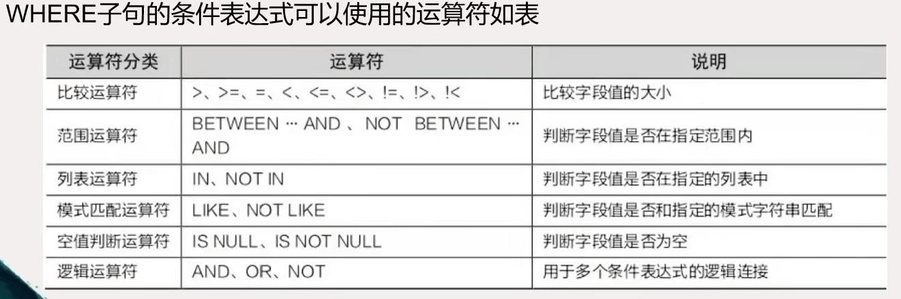
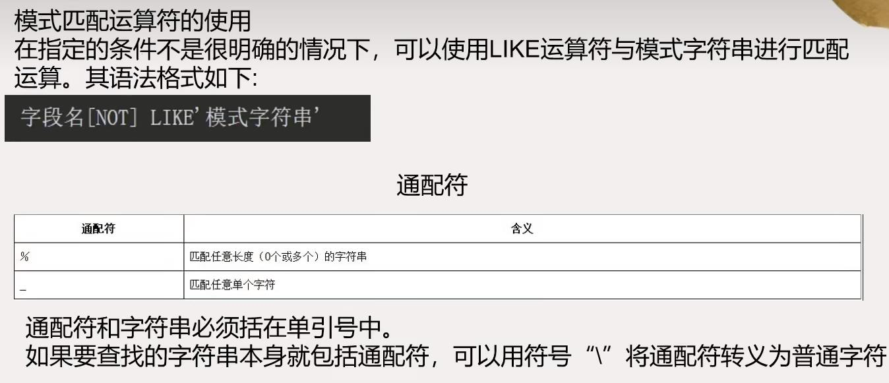
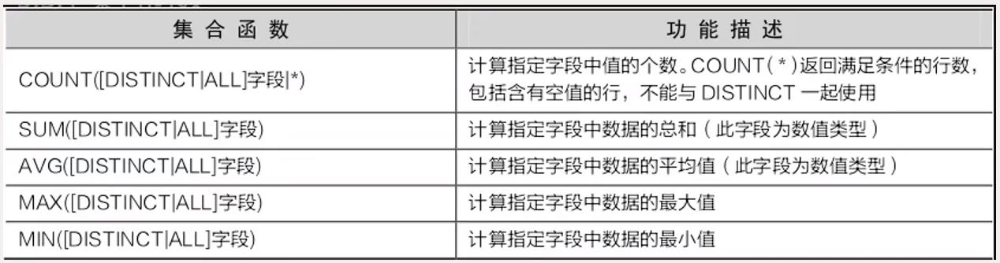

[TOC]
# `select`语句的基本语法
`SELECT [ALL|DISTINCT]要查询的内容`
`FROM 表名列表`
`[WHERE条件表达式]`
`[GROUP BY 字段名列表[HAVING 逻辑表达式]]`
`[ORDER BY 字段名[ASC|DESC]]`
`[LIMIT [OFFSER,] N];`
注意：
- 在上述语法结构中，`SELECT`查询语句共有7个子句，其中`SELECT`和`FROM`子句为必选子句，而`WHERE`、`GROUPBY`和`LIMIT`子句为可选子句，`HAVING`子句与`GROUP BY`子句联合使用，不能单独使用。
- `SELECT`子句既可以实现数据的简单查询、结果集的统计查询，也可以实现多表查询。
# 简单查询
## 基本查询
`SELECT [ALL|DISTINCT]要查询的内容`
`FROM表名列表;`
- 注：查询结果要输出表或视图的特定字段时，要明确指出字段名，多个字段名之间用逗号分开。
- 例：
  `SELECT sno,sname,sgender,sbirth,sclass`
  `FROM studentinfo`
  - 当要查询的内容是数据表中所有列的集合时，可以用符号“*”，来代表所有字段名的集合。例：`SELECT * FROM studentinfo;`
  - 可以使用`SELECT sno,sname,now()AS 查询日期 FROM studentinfo;`显示学号，姓名，以及此次查询的时间
## 使用`WHERE`子句
`WHERE`子句可以指定查询条件，用以从表中筛选出满足条件的数据行。其语法格式如下：
`SELECT [ALL|DISTINCT] 要查询的内容`
`FROM 表名列表`
`WHERE条件表示式;`

- 比较运算符的使用
  `SELECT * FROM studentinfo`
  `WHERE sclass='网络技术101';`
- 范围运算符的使用
  `SELECT * FROM studentinfo`
  `WHERE sbirth BETWEEN '1992-1-1' AND '1992-12-31';`
- 列表运算符的使用
  `SELECT * FROM studentinfo`
  `WHERE sno in ('10101001', '10102001', '11101001');`
- 模式匹配运算符的使用
  
  `SELECT * FROM studentinfo`
  `WHERE sname LIKE '张%';`
- 空值判断符的使用
  `IS [NOT] NULL`运算符用于判断指定字段的值是否为空值。对于空值判断，不能使用比较运算符或模式匹配运算符。
  `SELECT * FROM student FROM elective`
  `WHERE score IS NULL;`
- 逻辑运算符的使用
  查询条件可以是一个条件表达式，也可以是多个条件表达式的组合。逻辑运算符能够连接多个条件表达式，构成一个复杂的查询条件。逻辑运算符包括：`AND`、`OR`、`NOT`。
  `SELECT * FROM studentinfo`
  `WHERE sname Like '王%' AND sclass='电子商务111';`
  > `AND` 与 `OR` 同时出现时，`AND`优先级高

- 例：
  `SELECT * FROM studentinfo`
  `WHERE NOT(YEAR(sbirth)=1992);`

## 使用`ORDER BY`子句
在查询结果集中，数据行是按照它们在表中的顺序进行排序的。我们可以使用`ORDER BY`子句对查询结果集中的数据依照指定字段的值重新排序。语法格式：
`SELECT [ALL|DISTINCT]要查询的内容 FROM 表名列表`
`[WHERE条件表达式]`
`ORDER BY 字段名[ASC|DESC];`
- 例：
  `SELECT * FROM elective`
  `WHERE cno='c001'`
  `ORDER BY score DESC;`
## 使用`LIMIT`子句
使用`LIMIT`子句可以指定查询结果从哪一条记录开始，一共查询多少条记录。语法格式：
`SELECT [ALL|DISTINCT]要查询的内容 FROM 表名列表`
`[WHERE 条件表达式]`
`[ORDER BY 字段名 [ASC|DECS]]`
`LIMIT [OFFSET,] N;`
`LIMIT`子句接受一个或两个整数参数。其中`OFFSET`代表从第几行记录开始索引，n代表检索多少行记录。需要注意的是，`OFFSET`可以省略不写，默认取值为0，代表第一行记录开始索引。
- 例：
  `SELECT * FROM studentinfo`
  `LIMIT 3;`
# 统计查询
## 集合函数
`SELECCT`语句可以通过集合函数和`GROUP BY`子句、`HAVING`子句的组合对查询结果集进行求和、求平均值、求最大值、求最小值、分组等统计查询。
集合函数用于对查询结果集中的指定字段进行统计，并输出统计值。常用的集合函数：

- 例：
  `SELECT COUNT(*) AS 学生总人数 FROM studentinfo;`
  > 统计学生表中的记录行数
- 例：
  `SELECT COUNT(*) AS 学生总人数, SUM(score) AS 总成绩, AVG(score) 平均分, MAX(score) 最高分,MIN(score) 最低分 FROM elective WHERE cno='c001';`
## 使用`GROUP BY`子句
上述示例所进行的查询都是对查询结果集进行的，而`GROUP BY`子句用于对查询结果集按指定字段的值进行分组，字段值相同的放在一组。集合函数和`GROUP BY`子句配合使用，可以对查询结果进行分组统计。语法格式：
`SELECT [ALL|DISTINCT] 要查询的内容 FROM 表名列表`
`WHERE 条件表达式`
`GROUP BY 字段名列表 [HAVING 条件表达式];`
- 例：
  `SELECT sgender, count(*) AS 人数 FROM studentinfo`
  `GROUP BY sgender;`
- 例：
  `SELECT cno, count(sno) AS 所选学生人数, MAX(score) AS 最高分 FROM elective;`
  `GROUP BY cno`
> 注意：`GROUP BY`子句常和`HAVING`子句用于对分组后的结果进行条件筛选`HAVING`子句只能出现在`GROUP BY`子句后。

> `WHERE`子句与`HAVING`子句的区别如下：
> 1. `WHERE`子句设置的查询筛选条件在`GROUP BY`子句之前发生作用，并且条件中不能使用集合函数。
> 2. `HAVING`子句设置的查询筛选条件在`GROUP BY`子句之后发生作用，并且条件中允许使用集合函数。
当一个语句中同时出现了`WHERE`子句、`GROUP BY`子句，执行顺序如下：
1. 执行`WHERE`子句，从数据表中选取满足条件的数据行。
2. 由`GROUP BY`子句对选取的数据进行分组。
3. 执行集合函数。
4. 执行`HAVING`子句，选取满足条件的分组。
- 例：
  查询`elective`表中每门课成绩都在70-90之间的学生的学号
  `SELECT sno AS 每门成绩都在70-90之间的学生 FROM elective`
  `GROUP BY sno`
  `HAVING MIN(score)>=70 AND MAX(score)<=90;`
- 例：
  查询至少选修了三门课程的学生的学号
  `SELECT son,count(*) 选修课程数 FROM elective`
  `GROUP BY sno`
  `HAVING count(*)>=3;`
# 多表查询
在实际查询中，很多情况下用户需要的数据并不全在一个表中，而是存在于多个不同的表中，这时就要使用多表查询。多表查询是通过各个表之间的共同列的相关性来查询数据的。多表查询首先要在这些表中建立连接，再在连接生成的结果集基础上进行筛选。
`SELECT [表名.] 目标字段表达式[AS别名], ...`
`FROM 左表名[AS别名] 连接类型 右表名[AS 别名]`
`ON 连接条件`
`[WHERE 条件表达式];`
其中，连接类型以及运算符有以下几种。
  1. `CROSS JOIN`：交叉连接
  2. `INNER JOIN`或`JOIN`：内连接
  3. `LEFT JOIN`或`LEFT OUTER JOIN`：左外连接
  4. `RIGHT JOIN`或`RIGHT OUTER JOIN`：右外连接
  5. `FULL JOIN`或`FULL OUTER JOIN`：完全连接
## 交叉连接
交叉连接就是将要连接的两个表的所有行进行组合，也就是将第一个表的所有行分别与第二个表的每个行连接形成一个新的行。连接后生成的结果集的行数等于两个表的行数的乘积，字段个数等于两个表的字段个数的和。语法格式：
`SELECT 字段名列表`
`FROM 表名1 CROSS JOIN 表名2;`
## 内连接
内连接是指用比较运算符设置连接条件，只返回满足连接条件的数据行，是将交叉连接生成的结果集按照连接条件筛选后形成的。
内连接有以下两种语法格式：
`SELECT 字段名列表`
`FROM 表名1 [INNER] JOIN 表名2`
`ON 表名1.字段名 比较运算符 表名2.字段名;`
或者
`SELECT 字段名`
`FROM 表名1, 表名2`
`WHERE 表名1.字段名 比较运算符 表名2.字段名;`
内连接包括三种类型：等值连接、非等值连接和自然连接
1. 等值连接：在连接条件中使用等号（=）比较运算符来比较连接字段的值，其查询结果中包含被连接表的所有字段，包括重复字段。在等值连接中，两个表的连接条件通常采用“表1.主键字段=表2.外键字段”的形式。
2. 非等值连接：在连接条件中使用了除等号之外的比较运算符（>、<、>=、<=、！=）来比较连接字段的值。
3. 自然连接：与等值连接相同，都是在连接条件中使用比较运算符，但结果集中不包括重复字段。
## 外连接
外连接与内连接不同，有主从表之分。使用外连接时，以主表中每行数据去匹配从表中的数据行，如果符合连接条件则返回到结果集中；如果没有找到匹配的数据行，则在结果集中仍保留主表的数据行，相对应的从表中的字段则被填上`NULL`值。
语法格式：
`SELECT 字段名列表`
`FROM 表名1 LEFT|RIGHT JOIN 表名2`
`ON 表名1.字段名 比较运算符 表名2.字段名;`
外连接包含3种类型：左外连接、右外连接和全外连接。
1. 左外连接：即左表为主表，连接关键字为`LEFT JOIN`。将左表中的所有数据行与右表中的每行按连接条件进行匹配，结果集中包括左表中所有的数据行。左表中与右表没有相匹配记录的行，在结果集中对应的右表字段都以`NULL`来填充。`BIT`类型不允许为`NULL`，就以0填充。
2. 右外连接：即1右表为主表，连接关键字为`RIGHT JOIN`。将右表中的所有数据行与左表中的每行按连接条件进行匹配，结果集中包括右表中所有的数据行。右表中与左表没有相匹配记录的行，在结果集中对应的左表字段都以`NULL`来填充。
3. 全外连接：连接关键字为`FULL JOIN`。查询结果集中包括两个连接表的所有的数据行，若左表中每一行在右表中有匹配数据，则结果集中对应的右表的字段填入相应数据，否则填充`NULL`；若右边中某一行在左表中没有匹配数据，则结果集对应的左表字段填充为`NULL`
> 注意：外连接查询只适用于两个表
## 自连接
自连接就是一个表的两个副本之间的内连接，即同一个表名在`FROM`子句中出现两次，故为了区别，必须对表指定不同的别名，字段名前也要加上表的别名进行限定。
例：
`SELECT s2.sno, s2.sname`
`FROM studentinfo AS s1 JOIN studentinfo AS s2`
`ON s1.sclass=s2.sclass`
`WHERE s1.sno='11101001' AND s2.sno != '11101001';`
# 子查询
子查询是将一个`SELECT`语句嵌套在另一个`SELECT`语句的`WHERE`子句中的查询。包含子查询的`SELECT`语句称为父查询或外部查询。子查询可以多层嵌套，执行时由内向外，即每一个子查询在其上一级父查询之前被处理，其查询结果回送给父查询。
子查询也可以嵌套在`INSERT`、`UPDATE`、或`DELETE`语句中。使用子查询时，应注意一下几点。
1. 使用圆括号将子查询的`SELECT`语句括起来。
2. 当子查询的返回值为单个值时，子查询可以应用到任何表达式中。子查询有几种形式，分别是比较子查询、`IN`子查询、批量比较子查询和`EXISTS`子查询。
## 比较子查询
比较子查询是指在父查询与子查询之间用比较运算符进行连接的查询。在这种类型的子查询中，子查询返回的值最多只能有一个。
例：
`SELECT sno, score AS 音乐欣赏的成绩`
`FROM elective`
`WHERE cno=(SELCT cno FROM course WHERE cname='音乐欣赏');`
## `IN`子查询
`IN`子查询是指父查询与子查询之间用`IN`或`NOT IN`进行连接并判断某个字段的值是否在子查询查找到的集合中。
例：
`SELECT sname AS 考试不及格的学生`
`FROM studentinfo`
`WHERE sno IN (SELECT sno FROM elective WHERE score<60);`
## 批量比较子查询
批量比较子查询是指子查询的结果不止一个，父查询和子查询之间需要用比较运算符进行连接。这时候，就需要在子查询前面加上谓语`ALL`或`ANY`。
1. 使用`ANY`谓语在子查询前面使用`ANY`谓语时，会使用指定的比较运算符将一个表达式的值或字段的值与每一个子查询返回值进行比较，只要有一次比较的结果为`TRUE`，则整个表达式的值为`TRUE`，否则为`FALSE`。
2. 使用`ALL`谓语在子查询前面使用`ALL`谓语时，会使用指定的比较运算符将一个表达式的值或字段的值与每一个子查询返回值进行比较，只有当所有比较的结果都为`TRUE`时，整个表达式的值才为`TRUE`，否则返回`FALSE`。
## `EXISTS`子查询
`EXISTS`子查询是指在子查询前面加上`EXISTS`运算符或`NOT EXISTS`运算符，构成`EXISTS`表达式。如果子查询查找到了满足条件的数据行，那么`EXISTS`表达式的返回值为`TRUE`，否则为`FALSE`。
> 什么时候使用连接查询，什么时候使用子查询，参考原则如下：
> 1. 如果查询语句要输出的字段来自多个表时，用连接查询。
> 2. 如果查询语句要输出的字段来自一个表，但其`WHERE`子句涉及另一个表时，常用子查询。
> 3. 如果查询语句要输出的字段和`WHERE`子句都涉及一个表，但是`WHERE`子句的查询条件涉及应用集合函数进行数值比较时，一般用子查询。
## 在`INSERT`、`UPDATE`、`DELETE`语句中使用子查询
1. 在`INSERT`语句中使用子查询使用`INSERT...SELECT`语句可以将`SELECT`语句的查询结果添加到表中，一次可以添加多行。
  语法格式：
  `INSERT 表1[(字段名列表)]`
  `SELECT 字段名列表2 FROM 表2 [WHERE条件表达式]`
  > 注意使用本语句时，表1已结存在，且“字段名列表1”中字段个数、字段的顺序、字段的数据类型必须和“字段名列表2”中对应的字段信息一样或兼容。

例：
`INSERT INTO studs(sno,sname,sclass)`
`SELECT sno,sname,sclass FROM studentinfo WHERE sclass LINKE '电子商务%';`

2. 在`UPDATE`语句中使用子查询
   在`UPDATE`语句时，可以使用`WHERE`子句中使用子查询。
例：
`UPDATE course SET cperiod=cperiod-6`
`WHERE ctno IN (SELECT tno FROM teacher WHERE tpro='副教授');`

3. 在`DELETE`语句中使用子查询使用`DELETE`语句中，可以在`WHERE`子句中使用子查询。
例：
`DELETE FROM elective`
`WHERE sno=(SELECT sno FROM studentinfo WHERE sname='王斌');`
# 合并结果集
合并结果集是指对多个`SELECT`语句查询的结果集进行合并操作，组成一个结果集。合并结果集使用的运算符是`UNION`。使用`UNION`时，需要注意一下几点：
1. 所有`SELECT`语句中的字段个数必须相同。
2. 所有`SELECT`语句中对应的字段的数据类型必须相同或兼容。
3. 合并后的结果集中的字段名是第一个`SELECT`语句中各字段名。如果要为返回的字段指定别名，则必须在第一个`SELECT`语句中指定。
4. 使用`UNION`运算符合并结果集时，每一个`SELECT`语句语句本身不能包含`ORDER BY`子句，只能在最后使用一个`ORDER BY`子句对整个结果集进行排序，且在该`ORDER BY`子句中必须使用第一个`SELECT`语句中的字段名。
例：
`SELECT sno AS 编号, sname AS 姓名 FROM studentinfo;`
`UNION`
`SELECT tno AS 编号, tname AS FROM teacher;`
# 本章小结
1. 查询是数据库最常见的操作，`MySQL`使用`SELECT`语句进行数据查询。
2. `SELECT`语句最基本的格式包括`SELECT`和`FROM`两部分，格式如下：
`SELECT 要查询的内容`
`FROM 表名;`
其中，“要查询的内容”指出查询结果要输出的字段名列表，“表名”指出要从哪张数据表中进行查询。
3. `SELECT`语句中可以包含`WHERE`子句，用于指明查询条件。
4. `SELECT`语句中可以包含`ORDER BY`子句，用于对查询结果进行排序。
5. `SELECT`语句中可以包含`LIMIT`子句，用于对查询结果的输出数量进行限制。
6. `SELECT`语句中可以包含集合函数，用于对查询结果进行统计。`SELECT`语句还可以包含`GROUP BY`子句，用于对查询结果进行分组。`GROUP BY`子句常和集合函数配合使用。如果`SELECT`语句中没有包含`GROUP BY`子句，则集合函数对整个查询结果进行统计。如果`SELECT`语句中包含`GROUP BY`子句，则查询结果按分组进行统计。`GROUP BY`子句后可以加`HAVING`子句，用于对分组设置筛选条件。
7. 连接查询和子查询是实现多表查询的常见方式。