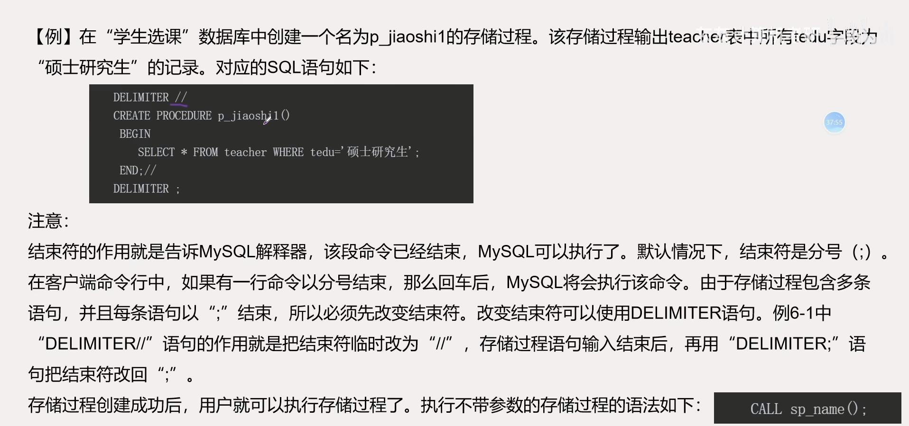
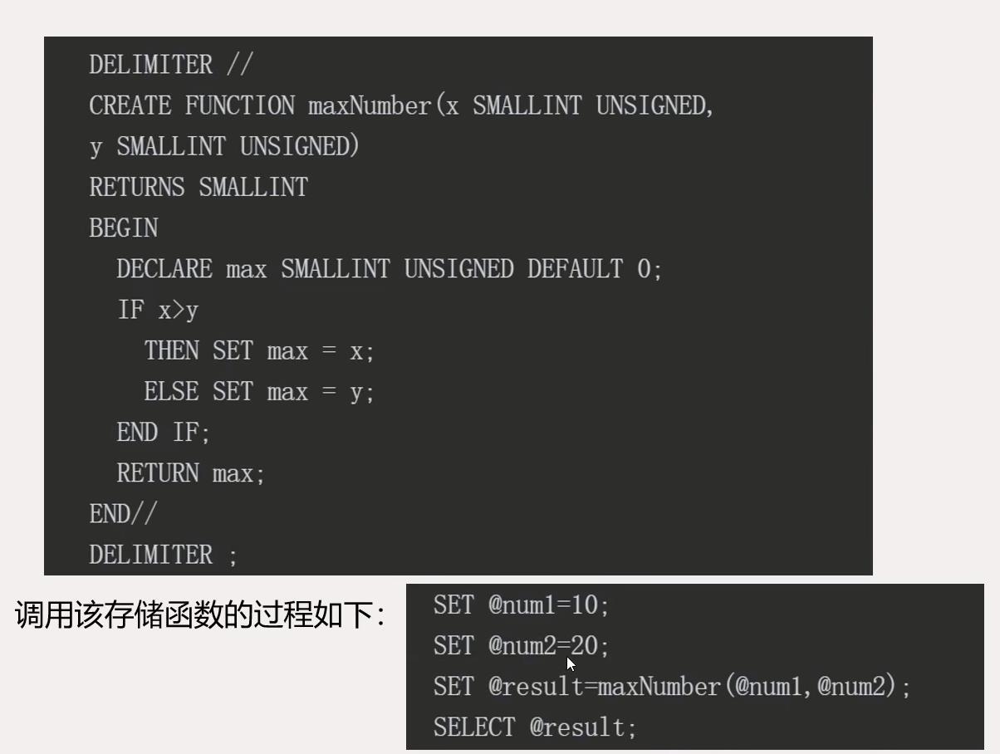
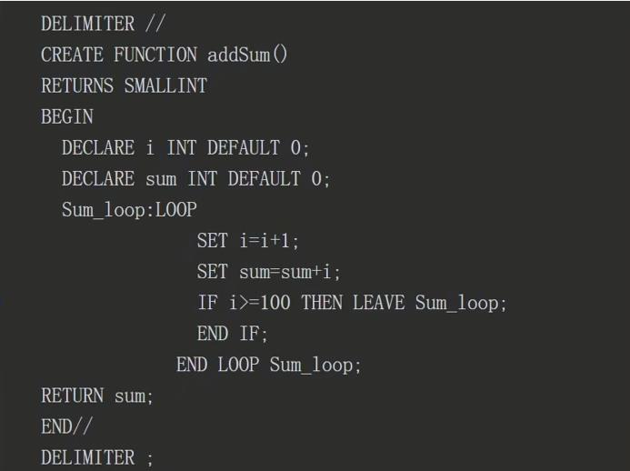
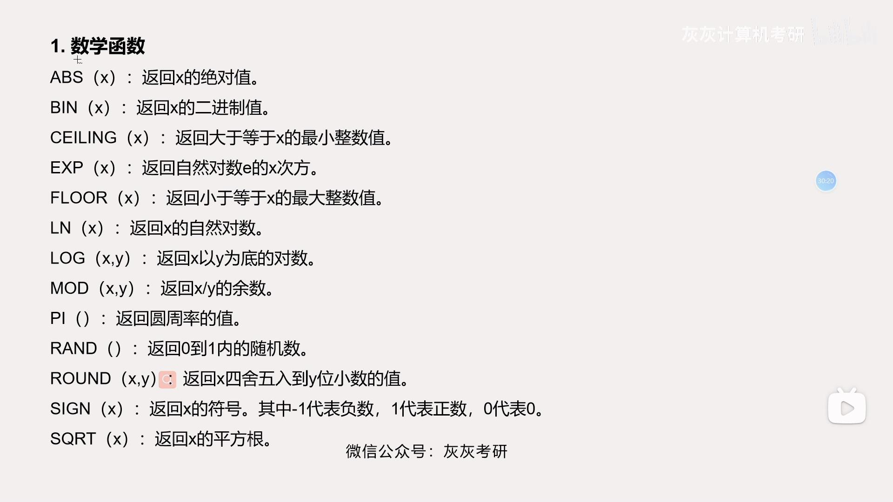
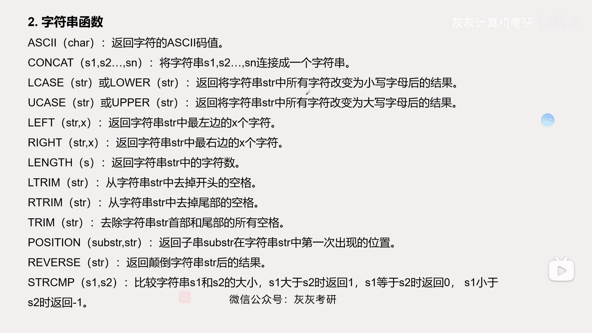
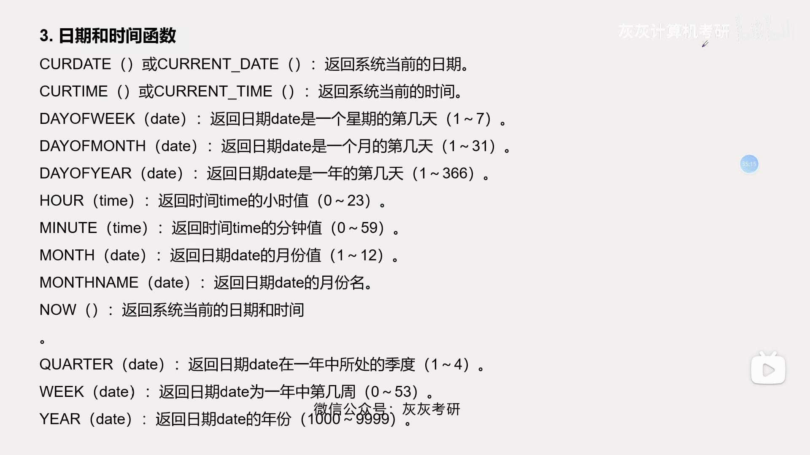
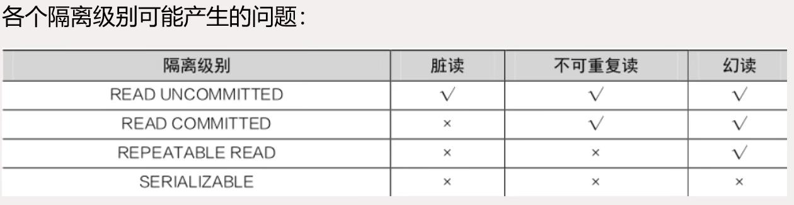

- 掌握变量的定义
- 掌握基本的流程控制语句
- 了解存储过程和存储函数
- 了解存储程序的类型
- 理解存储过程的作用
- 掌握存储过程的创建、修改和执行
- 掌握存储函数的创建和执行
- 掌握事物处理的过程
- 理解事务的隔离级别
[TOC]
# MySQL程序设计基础
## 变量
   在`MySQL`中最常见的变量类型有==局部变量==和==用户自定义变量==两种在`MySQL`中最常见的变量有局部变量和用户自定义变量两种。
   - 局部变量：局部变量一般定义在`SQL`的语句中，常用于存储函数的`BEGIN/END`语句块。==局部变量的作用域只限于定义它的语句块==，语句块执行完毕后，局部变量也随之释放。要定义局部变量必须使用`DECLARE`语句来声明，定义的同时可以使用`DEFAULT`子句对局部变量进行初始化赋值。`DECLARE`语句格式：
    `DECLARE var_name[, ...] type [DEFAULT value];`
    `value`是给局部变量提供的一个默认值，包含在`DEFAULT`子句中。如果没有`DEFAULT`子句，局部变量的初始值为`NULL`。例如：`DECLARE num int DEFAULT 0;`
    上述例子定义一个整型局部变量`num`并设置为初始值为0。
    `SET var_name = expr [, var_name = expr];`  `SET num=10;`
    > `SET`语句既可以用于局部变量的赋值，也可以用于用户定义自定义变量的声明及赋值。
   - 用户自定义变量：用户自定义变量的名字以“`@`”开头，形如：`@var_name`。为了在不同`SQL`语句中进行值的传递，可以把一些数值存储在用户自定义变量中，不同的`SQL`语句都可以访问。用户自定义变量在客户端和数据库的连接建立后被定义，直到连接断开时，用户变量才会被释放。用户自定义变量无需用`DECLARE`关键字进行定义，可以直接使用。例如:`SET @c1=1, @c2=2, @c2=4;`
  查看用户变量的值可以使用`SELECT`语句，例如：`SELECT @c1, @c2, @c3;`
## 流程控制语句
 在编写存储过程和存储函数时，可以使用流程控制语句对`SQL`语句进行组织，使其成为符合业务逻辑的代码块。`MySQL`中常见的流程控制语句主要有：`IF`语句、`CASE`语句、`LOOP`语句、`WHERE`语句、`ITERATE`语句、`REPEAT`语句等。
   1. `IF`语句：`IF`语句根据判断逻辑判断条件的值是`TRUE`还是`FALSE`，转去执行相应的分支中的语句。`IF`语句的语法格式：
   `IF expr_condition THEN statement_list`
   `[ELSEIF expr_conditon THEN statemen_list]`
   `[ELSE statement_list]`
   `END IF;`
   `IF`语句用于实现分支判断的程序结构。在上述语法格式中，`expr_condition`代表逻辑判断条件，`statement_list`代表一条或多条`SQL`语句。如果`expr_condition`的值为`TRUE`，则执行`THEN`后面的`SQL`语句块；如果`expr_condition`的值为`FALSE`，则执行`ELSE`后面的`SQL`语句块。例：
   `IF x>y`
   `THEN SELECT x;`
   `ELSE SELECT y;`
   `END IF;`
   2. `CASE`语句：`CASE`语句也是一个条件判断语句，用于多分支判断的程序结构，常见语法格式：
   `CASE case_expr`
   `WHERE when_value THEN statement_list`
   `[WHERE when_value THEN statement_list]`
   `[ELSE statement_list]`
   `END CASE;`
   其中，`case_expr`是一个表达式，`when_value`表示`case_expr`表达式可能的匹配值。如果某一个`when_value`的值与`case_expr`表达式的值相匹配，则执行对应的`THEN`关键字后的`statement_list`中的语句。如果所有`when_value`的值与`case_expr`表达式的值都不匹配，则执行`ELSE`关键字后的`statement_list`中的语句。下面给出一个`CASE`的代码片段，根据人名显示这个人的特征：
   `CASE name`
   `WHERE 'sam' THEN SELECT 'young';`
   `WHERE 'Lee' THEN SELECT 'hansome';`
   `ELSE SELECT 'good';`
   `END CASE;`
   3. `LOOP`语句`LOOP`是一个循环语句，用来实现对一个语句块的循环执行。`LOOP`语句并不能进行条件判断来决定何时退出循环，会一直执行循环语句。如果要退出循环，需要使用`LEAVE`等语句。`LOOP`语句格式：
   `[LOOP_lable:] LOOP`
   `Statement_list`
   `END LOOP [loop_lable];`
   4. `LEAVE`语句基本语法：
   `LEAVE lable;`
   5. `ITERATE`语句与`LEAVE`语句结束整个循环地功能不同，`ITERATE`语句的功能是结束本次循环，转到循环开始语句，进行下一次循环。`ITERATE`语句的格式：`ITERATE lable`
   6. `REPEAT`语句：`REPEAT`语句用于循环执行一个语句块，执行的流程是先执行一次循环语句块再进行条件表达式判断，如果条件表达式值为`TRUE`，则循环结束，否则再重复执行一次循环语句块。`REPEAT`语句的格式：
   `[repeat_lable:] REPEAT`
   `statemen_list`
   `UNTILL expr_condition`
   `END REPEAT [repeat_lable];`
   其中，`repeat_lable`为循环标记名称，是可选的。`statement_list`中的语句将会被循环执行，直到`expr_condition`表达式值为`TRUE`时才结束循环。
   7. `WHILE`语句：`WHILE`语句也用于循环执行一个语句块，但是与`REPEAT`语句不同，`WHILE`语句在执行时会首先判断条件表达式是否为`TRUE`，如果为`TRUE`则继续执行一次循环语句块，执行完后再判断条件表达式。如果条件表达式的值为`FALSE`，则直接退出循环。`WHILE`语句的格式：
   `[while_lable:] WHILE expr_condition DO`
   `Statement_list`
   `END WHILE [while_lable];`
## 光标
使用`SQL`语句对表中数据进行查询时，可能返回很多条记录。如果需要对查询结果集中的多条记录进行逐条读取，则需要使用光标。
   - 光标的声明要使用光标对查询结果集中的数据进行处理，首先需要声明光标。光标的声明必须在声明变量和条件之后，声明处理程序之前。光标的声明格式：
    `DECLARE cursor_name CURSOR FOR select_statement;`
    其中，`cursor_name`表示光标的名字，`select_statement`是光标的`SELECT`语句，返回一个用于创建光标的查询结果集。下面的代码用于声明一个名为`cur_teacher`的光标：
    `DECLARE cur_teacher CURSOR FOR SELECT name, age`
    `FROM teacher;`
   - 光标的使用光标在使用之前必须先打开。`MySQL`中使用`OPEN`关键字打开光标。从光标查询结果集中取出一条记录可用`FETCH`语句。其语法格式：
    `OPEN cursor_name;`
    `FETCH cursor_name INTO var_name[,var_name...];`
    代码使用名为`cur_teacher`的光标，将查询结果集中一条记录的`name`和`age`字段的值存入`teacher_name`和`teacher_age`变量中。
    `FETCH cur_teacher INTO teacher_name, teacher_age;`
    > 注意！`teacher_name`和`teacher_age`变量必须在声明光标之前定义。
    - 光标的关闭`MySQL`中使用`CLOSE`关键字来关闭光标。其语法格式：
    `CLOSE cursor_name;`
    光标关闭之后就不能再使用`FETCH`语句从光标查询结果集中取出数据了。每执行一次`FETCH`语句从查询结果集中取出一条记录，将该记录字段的值送入了指定的变量，通过循环可以逐条访问查询结果集中的所有记录。
# 存储过程概述
存储过程是数据库服务器上一组预先编译好的SQL语句的集合，作为一个对象存储在数据库中，可以被应用1程序作为一个整体例调用。在调用过程中，存储过程可以从调用者那里接受输入参数，执行后再通过参数向调用者返回处理结果。
## 存储过程的基本概念
在进行数据库开发的过程中，数据库开发人员经常把一些需要反复执行的代码放在一个独立的语句块中。这些能实现一定具体功能、独立放置的语句块，我们称之为“过程”（`Procedure`）。
`MySQL`的存储过程(`Stored Procedure`)，就是为了完成某一特定功能，把一组`SQL`语句集合经过编译后作为一个整体存储在数据库中。用户需要的时候，可以通过存储过程来调用存储过程。
## 存储过程的类型
在`MySQL`中，存储程序的方式主要分为以下四种。
1. 存储函数（`stored function`)。根据调用者提供的参数进行处理，最终返回调用者一个值作为函数处理结果。
2. 存储过程（`stored procedure`）。一般用来完成运算，并不返回结果。需要的时候可以把处理结果以参数的形式传递给调用者。
3. 触发器（`trigger`）。当执行`INSERT`、`UPDATE`、`DELETE`等操作时，将会引发与之关联的触发器自动执行。
4. 事件（`event`）。事件是根据事件调速器在预定时间自动执行的存储过程。
## 存储过程的作用
`MySQL`存储过程具有以下作用。
1. 存储过程的使用，提高了程序设计的灵活性。存储过程可以使用流程控制语句组织程序结构，方便实现结构较复杂的程序的编写，使设计过程具有很强的灵活性。
2. 存储过程把一组功能代码作为单位组件。一旦被创建，存储过程作为一个整体，可以被其他程序多次反复调用。对于数据库程序设计人员，可以根据实际情况，对存储过程进行维护，不会对调用程序产生不必要的影响。
3. 使用存储过程有利于提高程序的执行速度。在数据库操作中，因为存储过程在执行之前已经被预编译，对于包含大量`SQL`代码或者需要被反复执行的代码段，使用存储过程会大大提高其执行速度。相对于存储过程，批处理的`SQL`语句段在每次运行之前都要进行编译，导致运行速度较慢。
4. 使用存储过程能减少网络访问的负荷。在访问网络数据库的过程中，如果采用存储过程的方式对`SQL`语句进行组织，当需要调用存储过程时，仅需在网络中传输调用语句即可，从而大大减少了网络的流量和负载。
5. 作为一种安全机制，系统管理员可以充分利用存储过程对相应数据的访问权限进行限制，从而避免非授权用户的非法访问，进一步保证数据访问的安全性。
# 创建和执行存储过程
创建存储过程的语法格式：
`CREATE PROCEDURE sp_name ([proc_parameter[, ...]])`
`[characteristic]`
`routine_body`
其中：(1)`proc_parameter:[IN|OUT|INOUT]param_name type` (2)`characteristic:LANGUAGE SQL|[NOT]DETERMINISTIC|{CONSTAINS SQL|NO SQL|READSSQL DATA|MODIFIES SQL DATA}|SQLSECURITY{DEFINER|INVOKER}|COMMENT'string'`
## 创建和执行不带输入参数的存储过程
`CREATE PROCEDURE sp_name()`
`BEGIN`
`MySQL语句;`
`END;`

## 创建和执行带输入参数的存储过程
1. 创建带参数的存储过程输入参数是指调用程序向存储过程传递的参数，在创建存储过程时定义输入参数。
2. 执行带输入参数的存储过程执行带输入参数的存储过程有两种方法：一种是使用变量名传递参数值，另一种是直接传递一个值给参数。
   - 使用变量名传递参数值先通过语句`SET@parameter_name=value`给一个变量设定值，调用存储过程时再用该变量给参数传递值。其语法格式：
  `CALL procedure_name ([@parameter_name] [,...n]);`
   - 按给定表达式值传递参数在执行存储过程的语句中，直接给定参数的值。采用这种方式传递参数值，给定参数值的顺序必须与存储过程中定义的输入变量的顺序一致。其语法格式：
  `CALL procedure_name(value1, value2,..)`
3. 创建和执行带输出参数的存储过程
   如果需要从存储过程中返回一个或多个值，可以在创建存储过程的语句中定义输出参数。定义输出参数，需要早`CREATE PROCEDURE`语句中定义参数时参数名前面指定`OUT`关键字。语法格式：
   `OUT parameter_name datatype=[=default]`
# 管理存储过程
## 查看存储过程
存储过程创建后被存储在`information_schema`数据库的`ROUTINES`表中，其源代码被存放在系统数据库`mysql`的`proc`表中。可以使用以下两种方式来显示数据库内存储过程的列表。
1. `SELECT name FROM mysql.proc WHERE db='数据库名'`。
2. `SELECT routine_name FORM infomation_schema ROUTINES WHERE routine_schema='数据库名'`。使用"`SHOW PROCEDURE status WHERE db='数据库名'`"可以显示数据库内存储过程的名称和详细信息。
例：查看"学生选课"数据库内存储过程的信息。对应的`SQL`语句如下：
`USE 学生选课;`
`SELECT * FROM mysql.proc WHERE db='学生选课';`
> 使用"`SHOW CREATE PROCEDURE 数据库名.存储过程名;`"可以查看指定存储过程的定义语句等信息。

例：查看存储过程`p_jiaoshi3`的定义语句等信息。对应的SQL语句如下：
`USE 学生选课;`
`SHOW CREATE PROCEDURE p_jiaoshi3\G`
## 修改存储过程
修改存储过程是由`ALTER PROCEDURE`语句来完成的，语法格式：`ALTER PROCEDURE sp_name [characteristic...];`
> 注意！使用`ALTER PROCEDURE`语句只能修改存储过程的特性。如果要重新定义已有的存储过程，建议先删除该存储过程，然后再进行创建。

例：修改存储过程`p_jioashi1`的定义，将读写权限改为`MODIFIES SQLDATA`，并指明调用者可以执行。对应的`SQL`语句为：
`ALTER PROCEDURE p_jiaoshi1`
`MODIFIES SQL DATA`
`SQL SECURITY INVOKER;`
例：查询修改后的存储过程`p_jiaoshi1`的信息。对应的`SQL`语句为：
`SELECT SPECIFIC_NAME, SQL_DATA_ACESS, SECURITY_TYPE`
`FROM information_schema.ROUTINES`
`WHERE ROUTINE_NAME='p_jiaoshi1';`
## 删除存储过程
存储过程的删除是通过`DROP PROCEDURE`语句来实现的。语法格式：
`DROP PROCEDURE [IF EXISTS] sp_name;`
> 注意：删除时如果存储过程不存在，使用`IF EXISTS`语句可以防止发生错误。

例：删除“学生选课”数据库中的存储过程`p_jioashi2`。对应的`SQL`语句：
`USE 学生选课；`
`DROP PROCEDURE p_jiaoshi2;`

# 存储函数
## 存储过程与存储函数的联系与区别
存储函数和存储过程在结构上很相似，都是由`SQL`语句和过程式语句组成的代码段，都可以被别的应用程序或`SQL`语句所调用。
但是它们之间是有区别的，主要区别如下：
1. 存储函数由于本身就要返回处理的结果，所以不需要输出参数，而存储过程则需要用输出参数返回处理结果。
2. 存储函数不需要使用`CALL`语句进行调用，而存储过程必须使用`CALL`语句进行调用。
3. 存储函数必须使用`RETURN`语句返回结果，存储过程不需要`RETURN`语句返回结果。

## 创建和执行存储函数
在`MySQL`中，创建存储函数的基本语法结构如下：
`CREATE FUNCTION fn_name ([func_parameter[, ...]])`
`RETURN type`
`[characteristic...]`
`routine_body`
例：创建一个存储函数，返回两个数中的最大数。

例：创建一个存储函数，计算1到100的整数之和。对应的SQL语句如下：

调用该存储函数的过程如下：
`SET @result=addSum();`
`SELECT @result;`
## 查看存储函数
同存储过程相同，存储函数被创建之后，用户也可以使用同样的方法来查看用户创建的存储函数的相关信息。可以使用以下两种方式显示数据库内存储函数的列表。
1. `SELECT name FROM mysql.proc WHERE db='数据库名'`。
2. `SELECT routine_name FROM information_schema.ROUTINES WHERE routine_schema='数据库名'`。
> 使用“`SHOW PROCEDURE status WHERE db='数据库名'`”可以显示数据库内所有存储函数的名称和存储函数的详细信息，使用“`SHOW CREATE FUNCTION 数据库.存储函数名`”可以查看指定存储函数的定义信息。

## 删除存储函数
存储函数的删除是通过`DROP FUNCTION`语句来实现的。语法格式：`DROP FUNCTION [IF EXISTS] fn_name;`
例如：删除addSum函数，可以使用如下命令：
`DROP FUNCTION addSum;`

## MySQL的系数函数
为了更好地为用户服务，`MySQL`提供了丰富的系统函数，这些函数无需定义就能直接使用，其中包括数学函数、聚合函数、字符串函数、日期和时间函数等。

# 事物
所谓的事物是指由用户定义的一系列数据库更新操作，这些操作要么都执行，要么都不执行，是一个不可分割的逻辑工作单元。这里的更新操作主要是指对数据库内容产生修改作用的操作，如`INSERT`、`DELETE`、`UPDATE`等操作。事物是实现数据一致性的重要技术。例如在银行转账业务的处理过程中，客户A要给客户B转账。当转账进行到一半时，发生断电等异常事故，导致客户A的钱已转出，客户B的钱还没有转入，这样就会导致数据库中数据的不一致，给客户带来损失。在转账业务处理中引入事物机制，就可以在意外发生时撤销整个转账业务，恢复数据库到数据处理之前的状态，从而确保数据的一致性。
## 事物处理语句
### 启动事务
`MySQL`启动事务的语法格式：
   `START TRANSACTION;`
### 提交事物
启动事务之后，就开始执行事务内的SQL语句，当SQL语句执行完毕后，必须提供事物，才能使事物中的所有操作永久生效。提交事物的语法格式：
`COMMIT;`
### 回滚事物
当事务在执行过程中遇到错误时，事务中所有操作都要被取消，返回到事务执行前的状态，这就是回滚事务。回滚事务的语法格式：
`ROLLBACK;`
## 事务的特性
事务必须具有`ACID`特性，即原子性(`Atomicity`)、一致性(`Consistency`)、隔离性(`Isolation`)和持久性(`Durability`)。
### 原子性
原子性是指事务是一个不可分割的逻辑工作单元，事务处理的操作要么全部执行，要么全部不执行。
### 一致性
一致性是指事务在执行前后必须处于一致性状态。如果事务全部正确执行，数据库的变化将生效，从而处于有效状态；如果事务执行失败，系统将会回滚，从而数据库恢复到事务执行前的有效状态。
### 隔离性
隔离性是指多个事务并发执行时，各个事务之间不能相互干扰。
### 持久性
持久性是指事务完成后，事务对数据库中数据的修改将永久保存。
## 事务的提交
为了使事物中`SQL`语句执行的修改操作永久保存在数据库中，事物处理结束时必须由用户提交事物。
例如：在手动提交的方式下，启动一个事务，在`teacher`表中插入两条记录，具体语法格式：
`START TRANSACTION`
`INSERT INTO teacher`
`VALUES('t006','张君瑞','男','硕士研究生','副教授');`
`INSERT INTO teacher`
`VALUES('t007','赵楠','女','博士研究生','教授');`
执行之后用`SELECT`语句查询`teacher`表。
从以上结果来看，似乎已经完成了事务的处理，但是退出数据库重新登录后，再对`teacher`表进行查询。发现事务中的记录插入操作最终并未完成，这是因为事务未经提交(`COMMIT`)就已经退出数据库了，由于采用的是手动提交模式，事务中的操作被自动取消了。为了能够把两条记录永久写入数据库中，需要在事务处理结束后就加入`COMMIT`语句来完成整个事务的提交。具体代码为：
`START TRANSACTION`
`INSERT INTO teacher`
`VALUES('t006','张君瑞','男','硕士研究生','副教授');`
`INSERT INTO teacher`
`VALUES('t007','赵楠','女','博士研究生','教授');`
`COMMIT;`
## 事务的回滚
如果事务尚未提交出现了操作错误，可以通过事务的回滚来取消当前事务，把数据库恢复到事务处理之前的状态。
## 事务的隔离级别
`MySQL`在数据库访问过程中采用的是并发访问方式。在多个线程同时开启事务访问数据库时，可能会出现脏读、不可重复读以及幻读等情况。
1. 脏读
   脏读就是一个事务读取了另一个事务没有提交的数据。即第一个事务正在访问数据，并且对数据进行了修改，当这些修改还没有提交时，第二个事务访问和使用了这些数据。如果第一个事务回滚，那么第二个事务访问和使用的数据就是错误的脏数据。
2. 不可重复读
   不可重复读是指在一个事务内，对同一数据进行了两次相同查询，但返回结果不同。这是由于在一个事务两次读取数据之间，有第二个事务对数据进行了修改，造成了两次读取数据的结果不同。
3. 幻读
   幻读是指在同一事务，两次按相同条件查询到的记录不一样。造成幻读的原因在于事务处理没有结束时，其他事务对同一数据集合增加或删除了记录。为了避免以上情况的发生，`MySQL`设置了事务的四种隔离级别，由低到高分别为`READ UNCOMMITTED`、`READ COMMITTED`、`REPEATABLE READ`、`SERIALIZABLE`，能够有效地防止脏读、不可重复读以及幻读等情况。
- `READ UNCOMMITTED`是指“读未提交”，该级别下的事务可以读取另一个未提交事务的数据，它是最低事务隔离级别。这种隔离级别在实际应用中容易出现脏读等情况，因此很少被应用。
- `READ COMMITTED`是指“读提交”，该级别下的事务只能读取其他事务已经提交的数据。这种隔离级别容易出现不可重复读的问题。
- `REPEATABLE READ`是指“可重复读”，是指`MySQL`的默认事务隔离级别。它确保同一事务的多个实例并发读取数据时，读到的数据是相同的。这种隔离级别容易出现幻读的问题
- `SERIALIZABLE`是指“可串行化”，是指`MySQL`最高的事务隔离级别。它通过对事务进行强制性的排序，使事物之间不会相互冲突，从而解决幻读问题。但是这种隔离级别容易出现超时现象和锁竞争。

用户可以用`SET TRANSACTION`语句改变当前会话或所有新建连接的隔离级别。语法格式：
`SET [SESSION | GLOBAL] TRANSACTION ISOLATION LEVEL {READ UNCOMMITTED | READ COMMITTED | REPEATABLE READ | SERIALIZABLE}`
例：设置当前会话的隔离级别为`READ COMMITTED`，具体语法格式：
`SET SESSION TRANSACTION ISOLATION LEVEL READ COMMITTED;`

# 本章小结
- 变量的定义与赋值。
- 流程控制语句。
- 光标的定义与使用。
- 存储过程的创建、调用、修改和删除。
- 存储函数的创建、使用、查看和删除。
- 事务的特性，启动事务、提交事务、回滚事务的语句。
- 事务的隔离级别。