- 理解索引的概念和分类
- 掌握索引的创建
- 了解查看索引信息的方式
- 掌握创建视图
- 掌握管理视图
- 了解通过视图修改数据
- 了解触发器的概念
- 掌握创建、删除触发器
- 了解触发器的常见应用

[TOC]

# 索引
在数据库操作中，用户经常需要查找特点的数据，而索引则用来快速寻找那些具有特点值的记录。例如：当执行"`select * from student where sno='11101001'`"语句时，如果没有索引，`MqSQL`数据库必须从第一条记录开始扫描表，直至找到`sno`字段值是`11101001`的记录。表里面的记录数量越多，这个操作花费的时间代价就越高。如果在作为搜索条件的字段上创建了索引，`MySQL`在查找时，无需扫描任何记录即可迅速得到目标记录所在的位置，能大大提高查找的效率。
## 索引概述
如果把数据表看作一本书，则表的索引就如同书的目录一样，可以大大提高查询速度，改善数据库的性能。其具体表现如下：
1. 唯一性索引可以保证数据记录的唯一性。
2. 可以加快数据的索引速度。
3. 可以加快表与表之间的连接，这一点在实现数据的参照完整性方面有特别的意义。
4. 在使用`ORDERED BY` 和`GROUP BY`子句进行数据检索时，可以显著减少查询中分组和排序的时间。
5. 在检索数据的过程中使用优化隐藏器，可以提高系统性能。

## 索引的分类
### 普通索引
普通索引是由`KEY`或`INDEX`定义的索引，它是`MySQL`中的基本索引类型，允许在定义索引的字段中插入重复值和空值。该类型索引可以创建在任何数据类型中。
### 唯一索引
唯一索引是由`UNIQUE`定义的索引，指索引字段的值必须唯一，但允许有空值。如果是在多个字段上建立的组合索引，则字段值的组合必须唯一。在创建主键和唯一约束的字段上会自动创建唯一索引。主键索引是一种特殊的唯一索引，不允许有空值。
### 全文索引
全文索引是由`FULLTEXT`定义的索引，是指在定义索引的字段上支持值的全文查找。该索引类型允许在索引字段上插入重复值和空值，它只能创建在`CHAR`、`VARCHAR`或`TEXT`类型的字段上。旧版的`MySQL`只有`MyISAM`存储引擎支持全文索引，`MySQL 5.6`版本后`InnoDB`存储引擎也支持全文索引。
### 空间索引
空间索引是由`SPATIAL`定义的索引，是只能在空间数据类型的字段上建立的索引。`MySQL`中空间数据类型有4种，分别是`GEOMETRY`、`POINT`、`LINESTRING`和`POLYGON`。需要注意的是，创建空间索引的字段，必须将其声明为`NOT NULL`。旧版的`MySQL`只有`MyISAM`存储引擎支持空间索引，从`MySQL 5.7.4`实验室版本开始，`InnoDB`存储引擎新增了对空间索引的支持功能。
### 单列索引
单列索引指在表中单个字段上创建的索引。它可以是普通索引、唯一索引或者全文索引，只要保证该索引只对应表中的一个字段即可。
### 多列索引
多列索引指在表中多个字段上创建的索引。只有在查询条件中使用了这些字段中的第一个字段时，该索引才会被使用。例如在学生表的“学号” “姓名” 和“班级”字段上创建一个多列索引，那么，只有在查询条件中使用了“学号”字段时，该索引才会被使用。

## 索引的设计原则
索引设计不合理或缺少索引都会给数据库的应用造成障碍。高效的索引对于用户获得良好的性能体验非常重要。设计索引时，应该考虑以下原则：
1. 索引并非越多越好，一个表中如有大量的索引，不仅占用磁盘空间，而且会影响`INSERT`、`UPDATE`、`DELETE`等语句的性能。因为在更改表中的数据的同时，索引也会进行调整和更新。
2. 避免对经常更新的表建立过多的索引，并且索引中的字段要尽可能地少。对经常查询的字段应该建立索引，但要避免对不必要的字段建立索引。
3. 数据量小的表最好不要使用索引，由于数据较少，查询花费的时间可能比遍历索引的时间还要短，索引可能不会产生优化的效果。
4. 在不同值较少的字段上不要建立索引，字段中的不同值比较少，例如学生表的“性别”字段，只有“男”和“女”两个值，这样的字段就无须建立索引，建立索引后不但不会提高查询效率，反而会严重降低更新速度。
5. 为经常需要进行排序、分组和连接查询的字段建立索引，为频繁进行排序或分组的字段和经常进行连接查询的字段创建索引。

## 创建索引
1. 创建表的时候直接创建索引，用`CREATE TABLE`命令创建表的时候就创建索引，此方法简单、方便。语法格式：
   `CREATE TABLE 表名`
   `(字段名 数据类型[完整性约束条件],`
   `字段名 数据类型[完整性约束条件],`
   `...`
   `字段名 数据类型,`
   `[UNIQUE|FULLTEXT|SPATIAL] INDEX|KEY [别名](字段名[(长度)]) [ASC|DESC]`
   `);`
   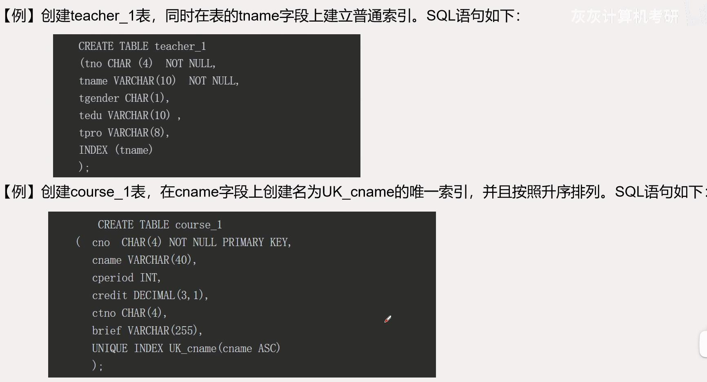
   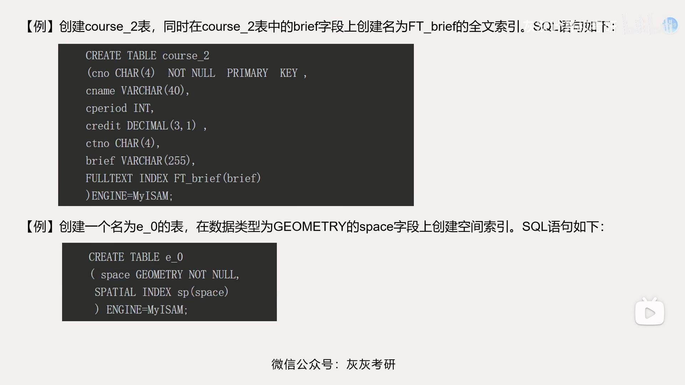
   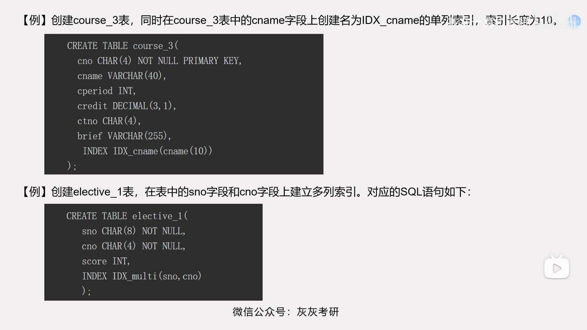
2. 在已经存在的表上使用`CREATE INDEX`创建索引
   `CREATE INDEX`语句基本语法：
   `CREATE [UNIQUE] [FULLTEXT] [SPATIAL] INDEX 索引名`
   `ON 表名(字段名[(长度)] [ASC| DESC] [, ...])`
- 先创建一个没有任何索引的学生表stu。表中包含`sno`（学号），`sname`（姓名），`sgender`（性别）字段，`sbirth`（出生日期）字段，`sclass`（班级）字段，`sresume`（简历）字段。
   创建`stu`表的`SQL`语句如下：
   `CREATE TABLE stu(`
   `sno char(8) NOT NULL,`
   `sname VARCHAR(10) NOT NULL,`
   `sgender CHAR(1),`
   `sbirth DATE,`
   `sclass VARCHAR(20),`
   `sresume VARCHAR(255)`
   `)ENGINE=MyISAM;`
   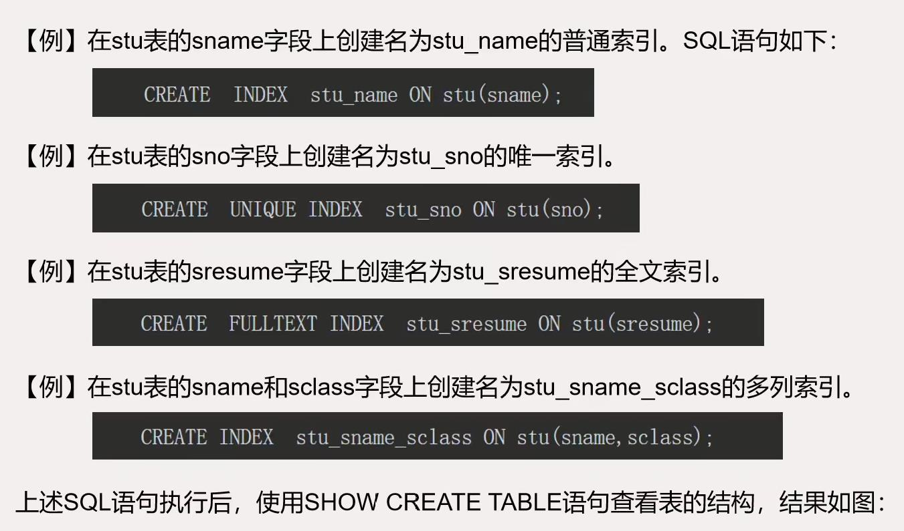
   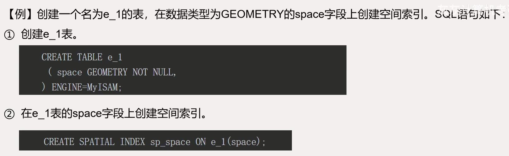
3. 在已存在的表上使用`ALTER TABLE`语句创建索引，语法格式：
   `ALTER TABLE 表名`
   `ADD [UNIQUE|FULLTEXT|SPATIAL] INDEX 索引名(字段名[(长度)] [ASC|DESC]);`
   
   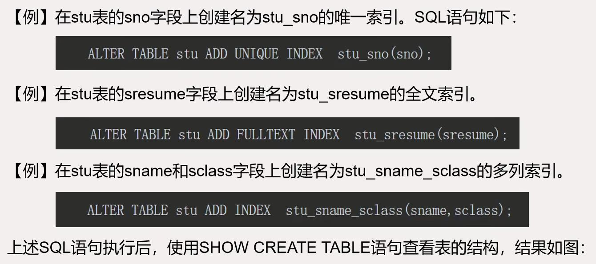
   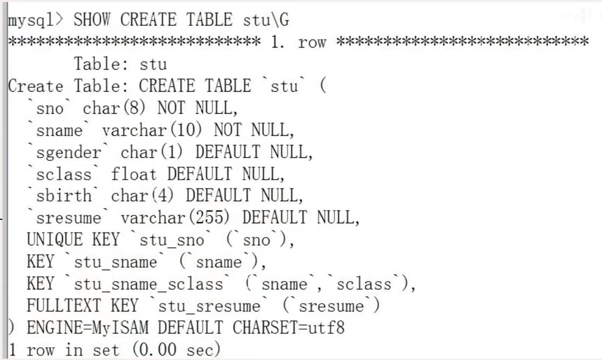
## 删除索引
如果某些索引降低了数据库的性能，或者根本就没有必要创建该索引，可以考虑将索引删除。删除索引有两种方式，具体如下：
1. 使用`DROP INDEX`删除索引：`DROP INDEX 索引名 ON 表明；`
2. 使用`ALTER TABLE`删除索引：`ALTER TABLE 表名 DROP INDEX 索引名;`

# 视图
## 视图的基本概念
视图是一种数据库对象，是从一个或多个基表（或视图）中导出的虚表。
视图的创建语句中，`SELECT`子句引用的数据表称为视图的基表，视图可以看作虚拟表或虚表。通过视图访问的数据不作为独立的对象存储在数据库内。视图被定义后便存储在数据库中，通过视图看到的数据只是存放在基表中的数据。
当对通过视图看到的数据进行修改时，相应的基表的数据也会发生变化，同时，若基表的数据发生变化，这种变化也会自动反映到视图中。视图可以是一个基表数据数据的一部分，也可以是多个基表数据的联合；视图也可以由一个或多个其他视图产生。
视图通常用来进行以下三种操作：
- 筛选表中的记录。
- 防止未经许可的用户访问敏感数据。
- 将多个物理数据表抽象为一个逻辑数据表。
视图上的操作和基表类似，但是数据库管理系统对视图的更新操作（`INSERT`、`DELETE`、`UPDATE`）往往存在一定的限制。数据库管理系统对视图进行的权限管理和基表也有所不同。
视图可以增强数据的逻辑独立性和安全性。
## 视图的优点
视图只是保存在数据库中的`SELECT`查询。因此，对查询执行的大多数操作也可以在视图上进行。也就是说视图只是给查询起了一个名字，把它作为对象保存在数据库中。只要使用简单的`SELECT`语句即可查看视图中查询的执行结果。视图是定义在基表（视图的数据源）之上的，对视图的一切操作最终会转换为对基表的操作。
为什么要引入视图？这是由于视图具有如下优点。
1. 视图能够简化用户的操作。视图使用户可以将注意力集中在自己关心的数据上，如果这些数据不是直接来自于基表，则可以通过定义视图，使用户眼中的数据结构简单、清晰，并且可以简化用户的查询操作。
例如，那些来源于若干张表连接查询的视图，就将表与表之间的连接操作对用户隐藏了起来。换句话说，用户所做的只是对一个虚表的简单查询，而这个虚表是怎样得到的，用户无需了解。
2. 视图使用户能从多角度看待同一数据。视图机制使不同的用户能以不同的方式看待同一数据，当不同用户使用同一数据库时，这种灵活性是非常重要的。
3. 视图使重构数据库具备逻辑独立性，数据的逻辑独立性是指当数据库重构时，如增加新的表或对原表增加新的字段，用户和用户程序不受影响。
4. 视图能够对机密数据提供安全机制保护。有了视图机制，就可以在设计数据库应用系统时，对不同的用户定义不同的视图，使机密数据不出现在不应看到这些数据的用户视图上。
## 定义视图
在`MySQL`中，使用`CREATE VIEW`语句创建视图。语法格式如下：
`CREATE [OR REPLACE] [ALGORITHM={UNDEFINED|MERGE|TEMPTABLE}]`
`VIEW 视图名 [(字段名列表)]`
`AS`
`SELECT 语句`
`[ WITH [CASCADED|LOCAL] CHECK OPTION ]`
在可更新视图中加入`WITH CHECK OPTION`子句，当该视图是根据另一个视图定义的时候，`LOCAL`和`CASCADED`关键字将决定检查测试的范围。`LOCAL`关键字对`CHECK OPTION`进行了限制，使其仅作用在定义的视图上，`CASCADED`关键字则会对该视图相关的所有视图和基表进行检查。如果未给定任一关键字，默认值为`CASCADED`。
创建视图时要求创建者具有针对视图的`CREATE VIEW`权限，以及针对`SELECT`语句选择的每一列上的某些权限。对于在`SELECT`语句中其他地方使用的列，创建者必须具有`SELECT`权限。如果还有`OR REPLACE`子句，创建者必须在视图上具有`DROP`权限。
视图属于数据库。默认情况下，将在当前数据库上创建新视图。如果想在指定数据库中创建视图，则需要将视图名称指定为"数据库名.视图名"。
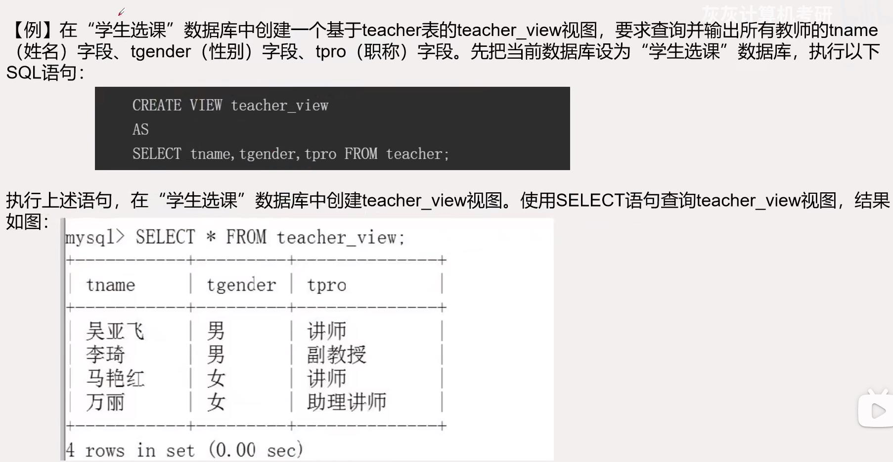
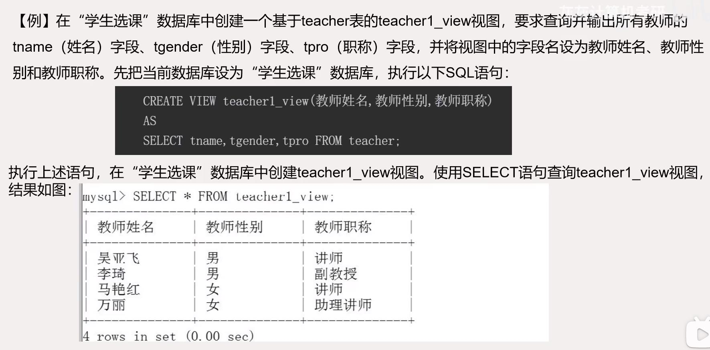
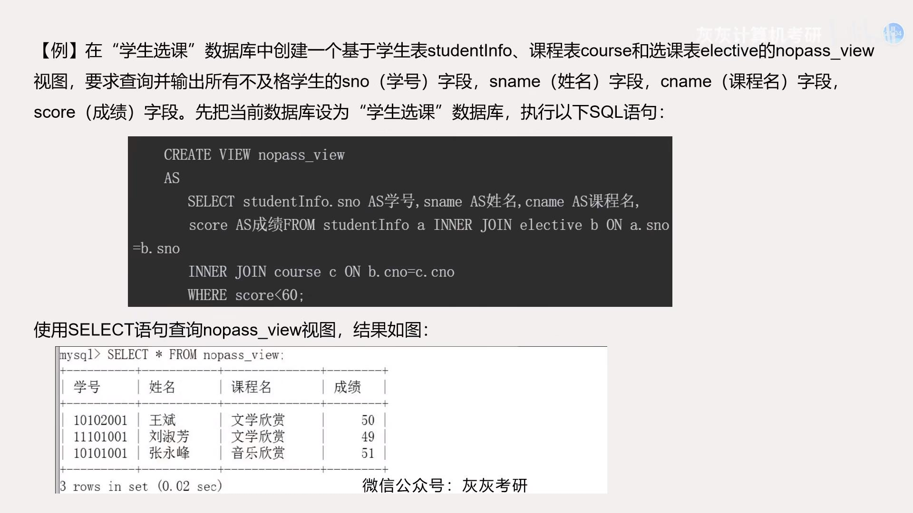
## 查看视图
查看视图，是指查看数据库中已经存在的视图的定义。查看视图必须有`SHOWVIEW`权限。查看视图的方式有三种。
1. 使用`DESCRIBE`语句查看视图在`MySQL`中，使用`DESCRIBE`语句可以查看视图的字段信息，包括字段名、字段类型等。`DESCRIBE`语句的语法格式为：
   `DESCRIBE 视图名;`
2. 使用`SHOW TABLE STATUS`语句查看视图：
   `SHOW TABLE STATUS LIKE '视图名';`
   对比发现：在表的现显示信息中，`Engine`（存储引擎）、`Date_length`（数据长度）、`Index_length`（索引长度）等项都有具体的值，但是`Comment`项没有信息，说明这是表而不是视图，这也是视图和表最直接的区别。
3. 使用`SHOW CREATE VIEW`语句查看视图在`MySQL`中，使用`SHOW CREATE VIEW`语句不仅可以查看创建视图的定义语句，还可以查看视图的字符编码以及视图中记录的行数。`SHOW CREATE VIEW`语句语法格式：
   `SHOW CREATE VIEW 视图名;`

## 修改和删除视图
### 修改视图
修改视图就是修改数据库中已经存在的视图的定义。在`MySQL`中，修改视图的方式有两种。
1. 使用`CREATE`或`REPLACE VIEW`语句。语法格式：
   `CREATE或REPLACE [ALGORITHM={UNDEFINED|MERGE|TEMPTABLE}]`
   `VIEW 视图名[(字段名列表)]`
   `AS`
   `select语句`
   `[WITH [CASCADED|LOCAL] CHECK OPTION]`
   > 使用`CREATE`或`REPLACE VIEW`创建视图时，如果视图已经存在，则用语句中的视图定义修改已存在的视图。如果视图不存在，则创建一个视图。
2. 使用`ALTER VIEW`语句。语法格式：
   `ALTER [ALGORITHM={UNDEFINED|MERGE|TEMPTABLE}]`
   `VIEW 视图名[(字段名列表)]`
   `AS`
   `SELECT语句`
   `[WITH [CASCADED|LOCAL] CHECK OPTION]`
   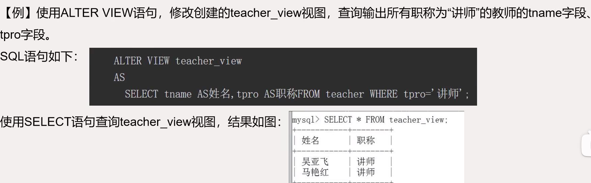

### 删除视图
当不需要视图时，可以将视图删除。删除视图只是将视图的定义删除，并不会影响到基表中的数据。删除视图的语法格式：`DROP VIEW [IF EXIESTS] 视图名1[,视图名2]...;`
在上述语法格式中，视图名可以有一个或多个，即同时删除一个或多个视图。视图名之间用逗号分隔。删除视图必须有`DROP VIEW`权限。`IF EXISTS`可选项表示删除时如果存在指定视图，则将指定视图删除，如果不存在指定视图，删除操作也不会出现错误。

## 更新视图
更新视图是指通过视图来插入、删除和更新基表中的数据。因为视图是一个虚拟表，其中并没有数据，修改视图中的数据实际上是在修改基表中的数据。只要满足一些限制条件，就可以通过视图自由地插入。删除和更新数据。
1. 使用`INSERT`语句向视图中插入数据，使用视图插入数据与基表中插入数据一样，都可以通过`INSERT`语句来实现。插入数据的操作是针对视图中字段的插入操作，而不是针对基表中所有字段的插入操作。使用视图插入数据要满足一定的限制条件。
   - 使用`INSERT`语句进行插入操作的用户必须有在基表中插入数据的权限，否则插入操作会失败。
   - 如果视图上没有包含基表中所有属性为`NOT NULL`的字段，那么插入操作会由于那些字段存在`NULL`值而失败。
   - 如果视图中的数据是由聚合函数或者表达式计算得到的，则插入操作不成功。
   - 不能再使用了`DISTINCT`、`UNION`、`TOP`、`GROUP BY`或`HAVING`子句的视图中插入数据。
   - 如果在创建视图的`CREATE VIEW`语句中使用了`WITH CHECK OPTION`子句，那么所有对视图进行修改的语句必须符合`WITH CHECK OPTION`中的限定条件。
   - 对于由多个基表连接查询而生成的视图来说，一次插入操作只能作用于一个基表上。
   
   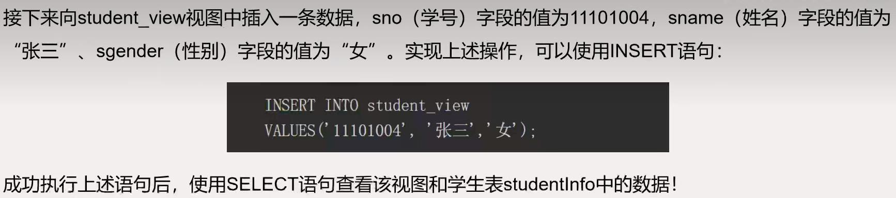
2. 使用`UPDATE`语句，更新视图中数据与在基表中更新数据一样，都需要使用`UPDATE`语句。当视图中的数据来源于多个基表时，与插入操作一样，每次更新操作只能更新一个基表中的数据。通过视图修改存在于多个基表中的数据时，要分别对不同的基表使用`UPDATE`语句。在视图中使用`UPDATE`语句进行更新操作时也会受到与进行插入操作时一样的限制。
   
   `UPDATE studentinfo_view`
   `SET sgender='男'`
   `where sname='张三';`
3. 使用`DELETE`语句删除数据，通过视图删除数据与在基表中删除数据的方式一样，都需要使用`DELETE`语句。在视图中删除的数据，同时也会从基表中删除。当一个视图连接了两个以上的基表时，对该视图中数据的删除操作是不允许的。
   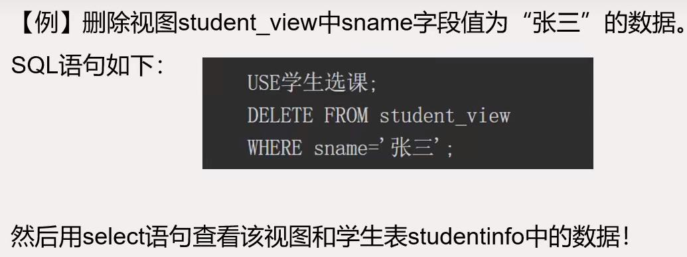

# 触发器
## 触发器概述
触发器是`MySQL 5.0`新增的功能，是一种与表操作（`INSERT`、`UPDATE`、`DELETE`）有关的数据库对象。触发器定义了一系列操作，这一系列操作称为触发程序。当触发器所在表上出现`INSERT`、`UPDATE`、`DELETE`操作时，将激活触发器。触发器基于一个表创建，但是可以针对多个表进行操作，因此触发器可以用来对表实施复杂的完整性约束。
触发器具有以下优点：
1. 触发器可以自动执行。当对表进行`INSERT`、`UPDATE`、`DELETE`操作，视图修改表中的数据时，相应操作的触发器立即自动执行。
2. 触发器可以对数据库相关表进行层叠更改。这比直接把代码写在前端的做法更安全合理。
3. 触发器可以实现表的约束实现不了的复杂约束。在触发器中可以引用其他表中的字段，从而实现多表之间的复杂约束。
4. 触发器可以维护冗余数据，实现外键级联等。

## 创建触发器
创建触发器用`CREATE TRIGGER`语句。语法格式：
`CREATE TRIGGER 触发器名`
`AFTER/BEFORE INSERT/UPDATE/DELETE ON 表名`
`FOR EACH ROW`
`BEGIN`
`SQL语句; #触发程序`
`END;`
1. 触发器是数据库对象，因此创建触发器时，需要指定该触发器属于哪一个数据库。
2. 触发器是在表上创建的。这个表必须是基表，不能是临时表，也不能是视图。
3. `MySQL`触发器的触发时间有三种：`INSERT`、`UPDATE`、`DELETE`。
   - `INSERT`：将新记录插入表时激活触发程序。
   - `UPDATE`：更改表中的记录时激活触发程序。
   - `DELETE`：从表中删除1记录时激活触发程序。
4. 触发器的触发时间有两种：`BEFORE`和`AFTER`。`BEFORE`表示在触发事件发生之前执行触发程序，`AFTER`表示在触发事件发生之后执行触发程序。
5. `FOR EACH ROW`表示行级触发器。目前，`MySQL`仅支持行级触发器，不支持语句1级别的触发器。`FOR EACH ROW`表示`INSERT`、`UPDATE`、`DELETE`操作影响的每一条记录都会执行一次触发程序。
6. 触发程序中的`SELECT`语句不能产生结果集。
7. 触发程序中可以使用`OLD`关键字与`NEW`关键字。
- 向表中插入新纪录时，在触发程序中可以使用`NEW`关键字表示新记录。当需要访问新纪录中的某个字段时，可以使用"`NEW.字段名`"进行访问。
- 从表中删除某条旧记录时，在触发程序中可以使用`OLD`关键字表示删除的旧记录。当需要访问删除的旧记录中的某个字段时，可以使用"`OLD.字段名`"进行访问。
- 修改表中的某条记录时，在触发程序中可以使用`NEW`关键字表示修改后的记录，使用`OLD`关键字表示修改前的记录。当需要访问修改后的记录中的某个字段时，可以使用"`NEW.字段名`"进行访问。当需要访问修改前的记录中的某个字段时，可以使用"`OLD.字段名`"进行访问。
- `OLD`记录是只读的，在触发程序中只能引用它，不能更改它。在`BEFORE`触发程序中，可使用"`SET NEW.字段名=值`"更改`NEW`记录的值。但在`AFTER`触发程序中，不能使用"`SET NEW.字段名=值`"更改`NEW`记录的值。
- 对于`INSERT`操作，只有`NEW`关键字是合法的。对于`DELETE`操作，只有`OLD`关键字是合法的。对于`UPDATE`操作，`NEW`关键字和`OLD`关键字都是合法的。
  
## 触发器的使用
### 检查约束
使用触发器实现检查约束在`MySQL`中，可以使用复合数据类型`SET`或`ENUM`对字段的取值范围进行检查约束，也可以实现对离散的字符串类型数据的检查约束。对于数值类型的字段，不建议使用`SET`或`ENUM`数据类型实现检查约束，可以使用触发器实现。
   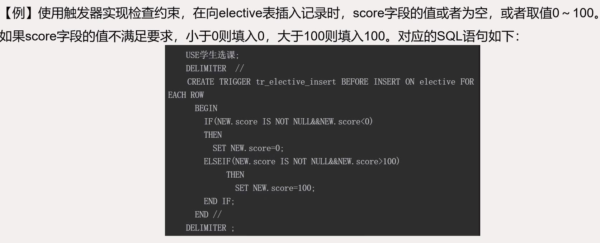
   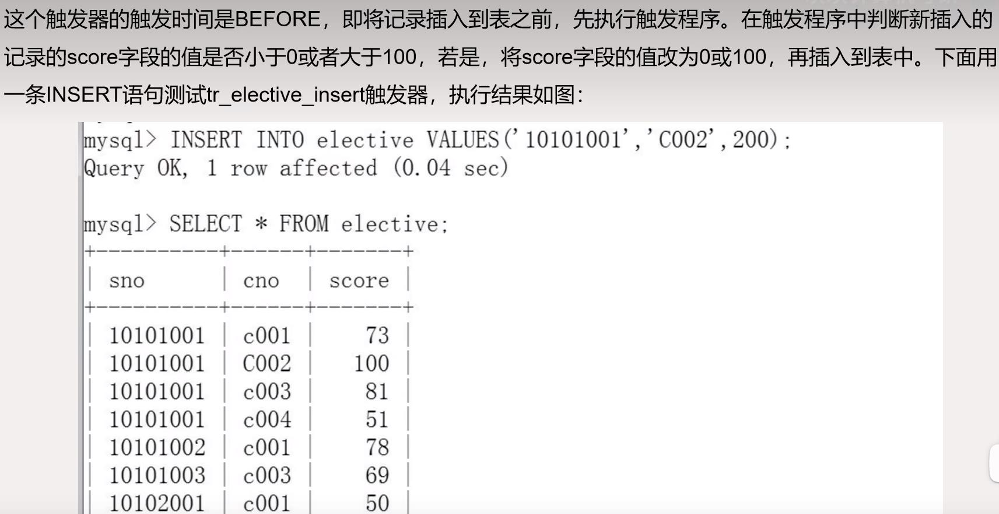
   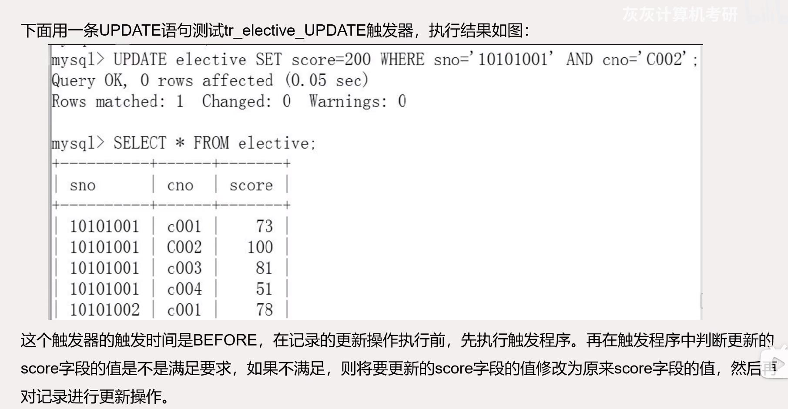
### 使用触发器维护冗余数据
冗余的数据需要额外的维护。维护冗余数据时，为了避免数据不一致问题的发生，最好交由系统（例如：触发器）自动维护。
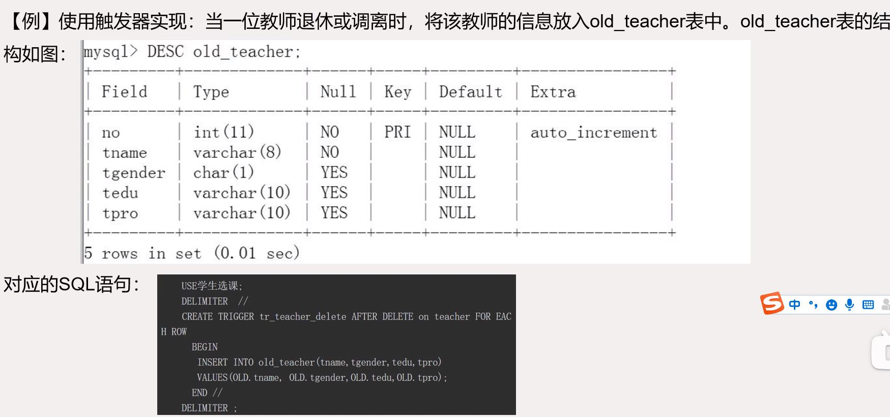
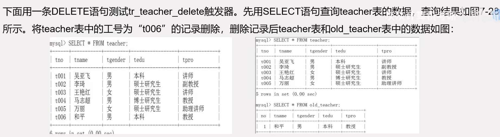
### 使用触发器实现外键级联选项
对于使用`InnoDB`存储引擎的表而言，可以通过设置外键级联选项`CASCADE`、`SETNULL`或者`NO ACTION`（`RESTRICT`），将外键约束关系交由`InnoDB`存储引擎自动维护1.
外键级联选项`CASCADE`、`SET NULL`或者`NO ACTION(RESTRICT)`的含义如下：
1. `CASCADE`：从父表中删除或更新对应的行时，同时自动删除或更新子表中匹配的行。`ON DELETE CASCADE`和`ON UPDATE CASCADE`都被`InnoDB`存储引擎所支持。
2. `SET NULL`：从父表中删除或更新对应的行时，同时将子表中的外键列设为空。注意，在外键列没有被约束为`NOT NULL`时才有效。`ON DELETE SET NULL` 和`ON UPDATE SET NULL`都被`InnoDB`存储引擎所支持。
3. `ON ACTION`：`InnoDB`存储引擎拒绝或更新父表。
4. `RESTRICT`：拒绝删除或者更新父表。指定`RESTRICT`（或者`NO ACTION`）好忽略`ON DELETE`或者`ON UPDATE`选项的效果是一样的。
对于使用`InnoDB`存储引擎的表之间存在外键约束关系但是没有设置级联选项或者使用的数据库表为`MyISAM`（`MyISAL`表不支持外键约束关系）时，可以使用触发器来实现外键约束之间的级联选项。
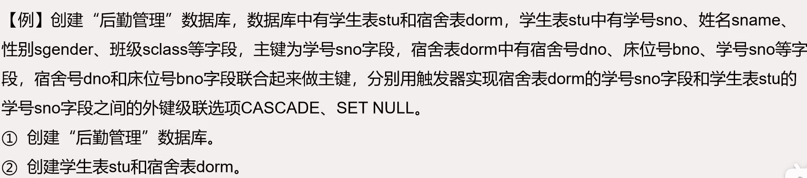
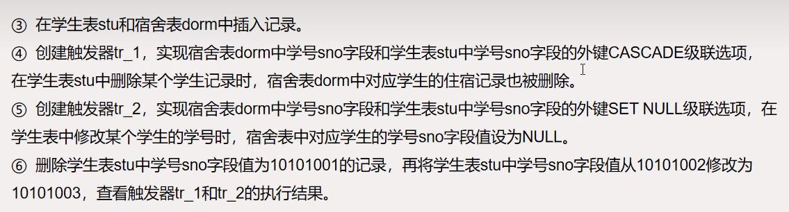
### 查看触发器的定义
1. 使用`SHOW TRIGGERS`命令查看触发器的定义。使用`SHOW TRIGGERS\G`命令可以查看当前数据库中所有触发器的信息。使用`SHOW TRIGGERS LIKE 模式\G`命令可以查看与模式模糊匹配的触发器的信息
   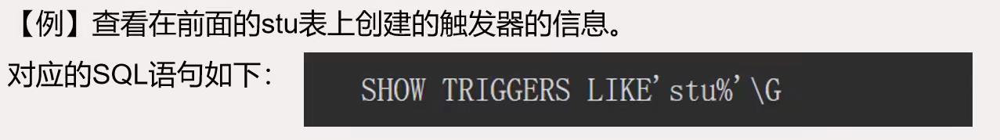
   > 当使用一个含有`SHOW TARIGGERS`的`LIKE`子句时，待匹配的表达式会与触发器定义时所在的表名称相比较，而不与触发器的名称相比较。
2. 使用`SHOW CREATE TRIGGER`命令查看触发器的定义。使用`SHOW CREATE TRIGGER 触发器名`命令可以查看指定名称的触发器的定义。
3. 通过查询`information_schema`数据库中的`triggers`表，可以查看触发器的定义。`MySQL`中所有触发器的定义都存放在`information_schema`数据库的`triggers`表中，查询`triggers`表时，可以查看所有数据库中所有触发器的详细信息，查询语句如下：`SELECT * FROM information_schema.triggers\G`
## 删除触发器
如果不再使用某个触发器，可以使用`DROP TRIGGER`语句将其删除。语法格式：`DROP TRIGGER 触发器名;`

# 本章小结
- 索引是一种特殊类型的数据对象，它可以用拉埃提高对表中数据的访问速度，而且还能够对表实施完整性约束。
- `MySQL`中的索引类型包括普通索引、唯一索引、全文索引和空间索引。其中，唯一索引要求任意两行的被索引字段不能存在重复值。索引可以在表中单个字段上创建，也可以在表中多个字段上创建。在多个字段上创建索引时，只有在查询条件中使用了这些字段中的第一个字段时，该索引才会被引用。
- 视图是从一个或多个表中导出来的表，是一种虚拟表。视图的结构和数据依赖于基本表。
- 视图可以简化查询语句，提高数据库的安全性。视图还可以修改基本表中的数据。
- 触发器是一种特殊类型的存储过程，在某个指定的事件发生时被激活。
- 触发器的两种类型：`AFTER`触发器和`BEFORE`触发器。`AFTER`触发器是先执行触发器事件，再执行触发过程。`BEFORE`触发器是先执行触发过程，再执行触发事件。
- `INSERT`触发器在对触发器表执行插入记录操作时被触发。`UPDATE`触发器在对触发器表执行更新记录操作时被触发。`DELETE`触发器表执行删除记录操作时被触发。
- 在触发过程中可以使用`NEW`关键字和`OLD`关键字。`NEW`关键字表示新插入的记录或更新后的记录，`OLD`关键字表示删除的记录或更新前的记录。
- 创建触发器使用`CREATE TRIGGER`命令，删除触发器使用`DELETE TRIGGER`命令。如果要修改触发器，可以先删除，再创建。